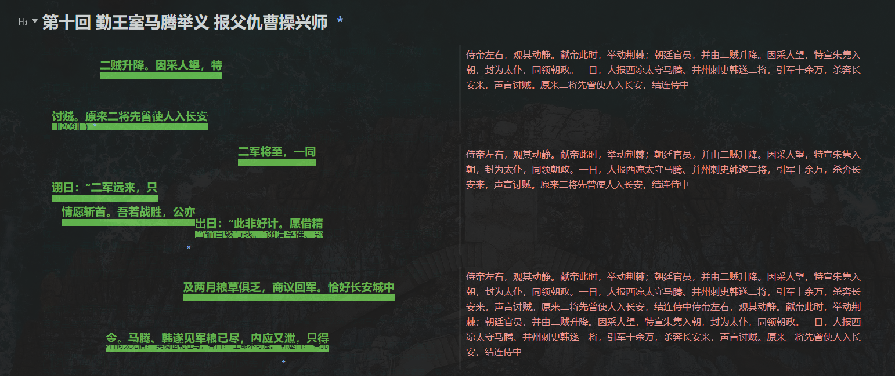
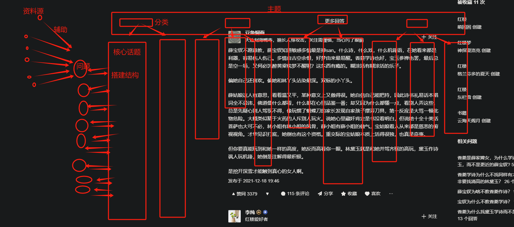
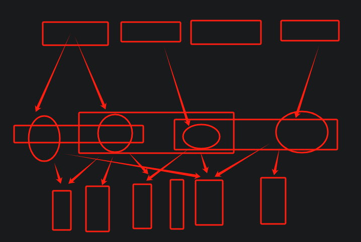
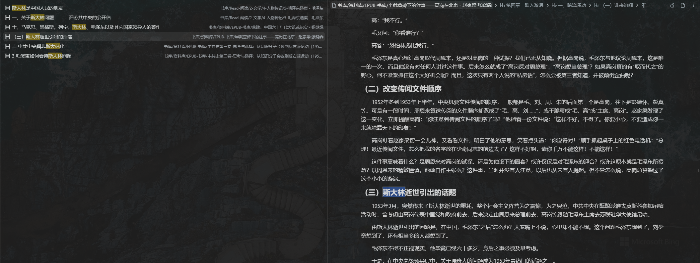

::: tip
SuprBlog主要用于思源笔记的外链访问，由VuePress2-Reco主题二次开发
:::

## 核心述求

### 1. 数据源

- 视频：Youtube/Bilibili/Douyin
- 书籍：BookxNote
- 网页：Zhihu/Quora/Wikipedia

> 思源目前主要承担一个资料库的角色，用于储存各个数据源录入的资料，经过分类和简单的整理加工，有价值的数据会以专题的模式同步到SuprBlog中，以便后续对接AI平台进行知识库的索引和检索

### 2. 目标

- 辅助学习的平台
- 垂直化，内容聚合
- 结构化
- 问题驱动
- 动态挖掘

## 开发计划

### 1. 基础功能

- 标注：支持对文章进行标注，有两个目的，一个是对关键细节进行标记，方便后续回顾，另外一个是针对核心点进行标记和总结，便于后续数据的索引和检索，目前打算用第三方云数据库firebase来存储，而且需要提供一个把原文和批注整合到一起的接口，这样就可以兼顾阅读时文章和批注分离，注入知识库时可以合为一个整体，页面提供两种模式，原文+批注模式，整合模式，这样比如在使用IMA的时候直接切换整合模式录入知识库，而从知识库溯源回原网页的时候又可以使用批注模式查看笔记的脉络，而且这里的批注模式是可以叠加第二点里的涂鸦，反正是尽可能的清晰快速准确的表达资料的核心要点
- 涂鸦：主要是便于快速回顾，这个可以借助于Chrome插件实现，比如Spade
- 串联：文章和视频、文章和文章、文章和网页进行串联，快速关联，方便回顾，这个其实在思源里面是比较方便的，但是如果是要外接给第三方AI平台，内部通过互相引用的方式是没法整合在一起输出的，所以这里的串联不能简单通过一个链接来实现，应该是基于批注的方式进行集成，可以集成网页某个片段或者视频的某个片段又或者是BookxNote、SiYuan里的外链
- 思维导图：结构化，前面几步专注于细节，而这一步专注于整体的结构，深度思考后的一个总结归纳
- 一键折叠，只看标注区域，快速专注
- QA：基于细节、结构进行提问回答，这里的问题统一管理，不同页面可能同时关联同一类话题，那这些页面之间可能可以进行一些整合和关联提出新的问题，比如三国演义第四回董卓废帝弄权，这个话题可以归于权臣、废帝，可能在看史记的时候看到霍光也有点这个意思，这样这两件事就可以进行对比和研究，后面可能看到王莽又有新的灵感，这样通过问题和话题来把不同源的知识串联在一起，形成一个独立于单个知识页的串联页，也可以说这就是一条笔记或者一条卡片笔记，这条卡片笔记可以在未来进行多次扩充和完善
- 书要反复看，把所有细节都摸透问透，才能达到进入深度思考的条件，否则只是在做知识的搬运工
- ALT+2豆包一键总结快捷键进行总结,动态生成AI导航条（正确的实现步骤应该是直接选段打标签，页面按顺序展示导航节点）
- 进度跟踪
- 建立问题库，这个问题库后续可以直接和AI平台对接，再由AI平台进行学习提问再总结
- RSS订阅库
- 主题抓取、剪切
- 灵感库

### 2. 主题

- 文学类：按章节切分，每个章节独立页面，核心人物、情节
- 历史类：按时间轴，事件、地点、人物、背景、起因、过程、结果、影响、启示
- 技术类：按场景，解决方案
- 古文类：按主题
- 工具类：一切从实践出发
- 人物传记类：际遇、经历、性格、成就、作品、评价
- 经济类：

### 3. 一些问题

- 全文检索：目前Algolia最多只支持8kb以下的文本，所以对于一些书籍原文来说，哪怕是分章节也无法达到全文检索的要求，所以需要针对章节进行一个批注-总结精简的过程，精简版的文章可以进行全文检索，而检索出的位置又可以快速关联到原文页
- 思源的一些问题：没有一个完整的单页面外链平台；整合后的笔记无法单独合并在一起对外展出，因为软件内部主要用引用来建立联系
- 拿思源存储数据以及API服务器，页面自己搭建，页面数据变动直接同步给思源，这样在一个地方维护一套数据

### 3. 功能拆解

- 文章批注：批注高亮，笔记放在右边

- 精简阅读：一键隐藏非标注文字，只看标注文字以及右侧笔记，并且可以进行保存，保存版需要去除多余文字，方便进行全文索引，而每一段的原文引用继续保留，这样方便溯源

- 全文检索：提供一个专题页用于存放所有精简版笔记，日常检索直接在专题库中执行，这个思源自己可以实现，还有一点就是搜索只搜标题和引述，所以日常做笔记的时候重要的点要多使用小标题，人物、事件，比如说红楼梦，有原著也有影视版还有解说版这些资料，影视版相对来说比较好做标题，因为本身就是围绕人物和事件推动的，所以在看视频的时候就要打上关键人物、事件这样的标题以及时间戳，这样在看原著的时候就可以直接引用这些标记点
- 一键抓取话题问题库：提交话题自动去知乎抓取这个话题相关的问题到问题页，然后用AI对问题进行分类整理出一个问题库，围绕这个话题的问题库搭建学习页面，从问题推导学习，但是学习后知识还是需要有结构的整理，这个主题库后续会有若干个tab，每个tab对应一个子类，比如红楼梦是一个话题，围绕红楼梦会有多维度的问题，比如人物类、剧情类、细节控、时代背景、假设性提问类似这样垂直化的子类，这个类似于标签，每个标签对应一系列的问题，问题详情页会关联到多个数据源以及笔记和反思；红楼梦->人物->林黛玉->[多问题：1、贾母喜欢林黛玉吗？2、林黛玉的处世之道？3、林黛玉可能做妾吗？等等等等]->[问题页：原文引用、视频批注、文本引用、个人总结、关联问题]，基于子类的多个问题之后，其实对于子类本身也会有一个结构性的理解，也就是最后要对子类进行结构性的总结，它的依据就是其下的问题；后续形成了问题库后，可以让ai基于问题库进行提问，然后尝试解答学习ai的部分思路，继续完善问题库，这里的问题就是一个独立个体，不是一条笔记而是实际意义的知识；
- 完整工作流：关注话题->抓取问题->问题分类->核心话题->多维度解决问题->多问题搭建核心话题结构->核心之间关联(这个让ai辅助，自己做关联维护成本太高)->AI问题挖掘->独立回答+AI辅助->补充信息源完善问题库->循坏问答

- 定制思源首页：
- 标注内容提供外部引用，url+#锚点,然后问题页+引用页左右分屏

### 4. 开发计划

- [x] 开发一个单体页面，页面里面调用思源接口进行数据同步
- [ ] 以专题作为核心
- [ ] 自定义路径
- [ ] 一本书反复读，每次读出不同心意，关注点也不同，是否可以给一篇文章每一轮阅读做个记录，记录每轮阅读的关注重点以及思考，电子档批注版
- [ ] 文档全部设计成左右布局，文章左侧是全文，右侧是精简版又或者是引用页，视频原本就是左右布局，而
- [ ] 先用思源搭建一套专题页，看有哪方面的缺陷，然后看在思源的基础上能够改善，剩下的交给SuprBlog
- [ ] 看视频的时候，有些片段特别想关联下原文或者其他资料，这个可以在视频进度条位置进行标记，然后引用具体资料，这里最大的问题是怎么定位资料的片段，思源这一点做的很好，但是在平台里怎么做呢，还涉及到数据的保存，目前想来还是让思源来做这个事，结构化的数据统一由思源管理，平台更多的是负责呈现，把知识更立体的表现出来
- [ ] 需不需要一个数据同步，把数据同步到SuprBlog，支持增量覆盖，本地环境提供维护功能，感觉先不要
- [ ] web端功能页面设计，思源数据库或者文件树提供数据管理
- [ ] 完整工作流梳理
- [ ] web端要不要批注，要不要更新，更新后要不要写回，思考一下，思源在其中到底算一个什么角色，目前想法，原始数据可以留在思源，比如书籍、抓取的数据源等等，但是整合的笔记统一在平台管理，设置是笔记的整个过程都在平台处理，思源只是用来存储最基本的数据使用，也可以充当一下数据库的功能
- [ ] 双屏模式，使用场景：打开外链，设置是思源单页面，或者是平台编辑页又或者是思维导图、AI工具或者是页面笔记之类的
- [ ] 简易模式和完整模式开发
- [ ] 制定笔记规范，从标题到句子的长短，页面的结构都需要设计，让人可以快速进入思考
- [ ] 字体要有变化，有大有小，有粗细，有颜色，一眼能看出重点，不要做整理，整理来整理去越弄越多越多越容易忘，尽可能的是减少记忆的负担，一句话一张图一个问题把人给套住
- [x] 思源单体页面加个搜索
- [ ] 思源页面提供token配置，自动加载本地思源笔记数据
- [ ] 插件开发知乎主题爬虫，批量爬取入库，按主题-问题-高赞回答，支持增量爬取