# SOS救助父母 - 未知
* > 第一章为什么孩子守规矩和不守规矩？ [P17](bookxnotepro://opennote/?nb={1b6f86e1-e6eb-4b4f-8b8f-12cb8f9ff7f8}&book=54aaecb2923ad3219d1b7e4a0b97583b&page=17&x=190&y=100&id=22&uuid=97f26c596e9def2e84b2f4babf2541c4)
  
* > 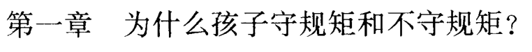 [P17](bookxnotepro://opennote/?nb={1b6f86e1-e6eb-4b4f-8b8f-12cb8f9ff7f8}&book=54aaecb2923ad3219d1b7e4a0b97583b&page=17&x=190&y=100&id=22&uuid=97f26c596e9def2e84b2f4babf2541c4)
    * > 教养孩子的三个基本原则 [P18](bookxnotepro://opennote/?nb={1b6f86e1-e6eb-4b4f-8b8f-12cb8f9ff7f8}&book=54aaecb2923ad3219d1b7e4a0b97583b&page=18&x=156&y=134&id=23&uuid=a71dcc2d68e01efa0e0546cad763cd22)
      
    * > 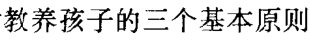 [P18](bookxnotepro://opennote/?nb={1b6f86e1-e6eb-4b4f-8b8f-12cb8f9ff7f8}&book=54aaecb2923ad3219d1b7e4a0b97583b&page=18&x=156&y=134&id=23&uuid=a71dcc2d68e01efa0e0546cad763cd22)
        * > 1.奖励良好行为（及时且经常）。 [P18](bookxnotepro://opennote/?nb={1b6f86e1-e6eb-4b4f-8b8f-12cb8f9ff7f8}&book=54aaecb2923ad3219d1b7e4a0b97583b&page=18&x=145&y=364&id=24&uuid=6ce334aa503e6774f624891372b3f388)
          
        * > 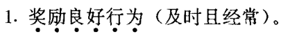 [P18](bookxnotepro://opennote/?nb={1b6f86e1-e6eb-4b4f-8b8f-12cb8f9ff7f8}&book=54aaecb2923ad3219d1b7e4a0b97583b&page=18&x=145&y=364&id=24&uuid=6ce334aa503e6774f624891372b3f388)
        * > 2.不要“无意中”奖励不良行为 [P21](bookxnotepro://opennote/?nb={1b6f86e1-e6eb-4b4f-8b8f-12cb8f9ff7f8}&book=54aaecb2923ad3219d1b7e4a0b97583b&page=21&x=142&y=166&id=25&uuid=72d6d0d17d3772d82a5401d218c6c28c)
          
        * > 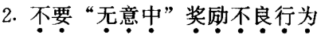 [P21](bookxnotepro://opennote/?nb={1b6f86e1-e6eb-4b4f-8b8f-12cb8f9ff7f8}&book=54aaecb2923ad3219d1b7e4a0b97583b&page=21&x=142&y=166&id=25&uuid=72d6d0d17d3772d82a5401d218c6c28c)
        * > 3.惩罚某些不良行为（但只用温和的惩罚） [P23](bookxnotepro://opennote/?nb={1b6f86e1-e6eb-4b4f-8b8f-12cb8f9ff7f8}&book=54aaecb2923ad3219d1b7e4a0b97583b&page=23&x=164&y=441&id=26&uuid=e15fd03d2b5928f9f62ffb083f39e634)
          
        * > 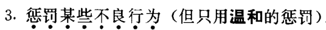 [P23](bookxnotepro://opennote/?nb={1b6f86e1-e6eb-4b4f-8b8f-12cb8f9ff7f8}&book=54aaecb2923ad3219d1b7e4a0b97583b&page=23&x=164&y=441&id=26&uuid=e15fd03d2b5928f9f62ffb083f39e634)
    * > 教养孩子的四种错误 [P24](bookxnotepro://opennote/?nb={1b6f86e1-e6eb-4b4f-8b8f-12cb8f9ff7f8}&book=54aaecb2923ad3219d1b7e4a0b97583b&page=24&x=213&y=259&id=27&uuid=87f35518f336cb8a200ee16806d75afd)
      
    * > 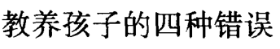 [P24](bookxnotepro://opennote/?nb={1b6f86e1-e6eb-4b4f-8b8f-12cb8f9ff7f8}&book=54aaecb2923ad3219d1b7e4a0b97583b&page=24&x=213&y=259&id=27&uuid=87f35518f336cb8a200ee16806d75afd)
        * > 1.父母未能奖励良好行为。 [P24](bookxnotepro://opennote/?nb={1b6f86e1-e6eb-4b4f-8b8f-12cb8f9ff7f8}&book=54aaecb2923ad3219d1b7e4a0b97583b&page=24&x=128&y=501&id=28&uuid=0618c1dc2777082a2f2c5a4f3120da14)
          
        * > 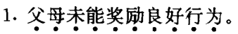 [P24](bookxnotepro://opennote/?nb={1b6f86e1-e6eb-4b4f-8b8f-12cb8f9ff7f8}&book=54aaecb2923ad3219d1b7e4a0b97583b&page=24&x=128&y=501&id=28&uuid=0618c1dc2777082a2f2c5a4f3120da14)
        * > 2.父母无意中惩罚了良好行为 [P25](bookxnotepro://opennote/?nb={1b6f86e1-e6eb-4b4f-8b8f-12cb8f9ff7f8}&book=54aaecb2923ad3219d1b7e4a0b97583b&page=25&x=135&y=169&id=29&uuid=d7204e0dd3f6f51c98e06246cd6e3f91)
          
        * > 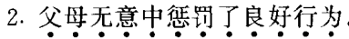 [P25](bookxnotepro://opennote/?nb={1b6f86e1-e6eb-4b4f-8b8f-12cb8f9ff7f8}&book=54aaecb2923ad3219d1b7e4a0b97583b&page=25&x=135&y=169&id=29&uuid=d7204e0dd3f6f51c98e06246cd6e3f91)
        * > 3.父母无意中奖励了不良行为。 [P25](bookxnotepro://opennote/?nb={1b6f86e1-e6eb-4b4f-8b8f-12cb8f9ff7f8}&book=54aaecb2923ad3219d1b7e4a0b97583b&page=25&x=138&y=264&id=30&uuid=312fb29d2814f5c81ceaf1b9ba666ae3)
          
        * > 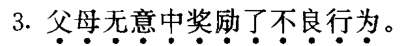 [P25](bookxnotepro://opennote/?nb={1b6f86e1-e6eb-4b4f-8b8f-12cb8f9ff7f8}&book=54aaecb2923ad3219d1b7e4a0b97583b&page=25&x=138&y=264&id=30&uuid=312fb29d2814f5c81ceaf1b9ba666ae3)
        * > 4.父母未能惩罚不良行为（当需要温和的惩罚时） [P25](bookxnotepro://opennote/?nb={1b6f86e1-e6eb-4b4f-8b8f-12cb8f9ff7f8}&book=54aaecb2923ad3219d1b7e4a0b97583b&page=25&x=182&y=374&id=31&uuid=ed4ebdb2fed90c4e8285bf078ca770f6)
          
        * >  [P25](bookxnotepro://opennote/?nb={1b6f86e1-e6eb-4b4f-8b8f-12cb8f9ff7f8}&book=54aaecb2923ad3219d1b7e4a0b97583b&page=25&x=182&y=374&id=31&uuid=ed4ebdb2fed90c4e8285bf078ca770f6)
    * > 要点 [P26](bookxnotepro://opennote/?nb={1b6f86e1-e6eb-4b4f-8b8f-12cb8f9ff7f8}&book=54aaecb2923ad3219d1b7e4a0b97583b&page=26&x=118&y=191&id=33&uuid=c19370f27a96c7abe413f9d0111d947e)
      
    * > 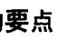 [P26](bookxnotepro://opennote/?nb={1b6f86e1-e6eb-4b4f-8b8f-12cb8f9ff7f8}&book=54aaecb2923ad3219d1b7e4a0b97583b&page=26&x=118&y=191&id=33&uuid=c19370f27a96c7abe413f9d0111d947e)
        * > 1.受到奖励时，良好行为与不良行为都会增强。 [P26](bookxnotepro://opennote/?nb={1b6f86e1-e6eb-4b4f-8b8f-12cb8f9ff7f8}&book=54aaecb2923ad3219d1b7e4a0b97583b&page=26&x=175&y=206&id=35&uuid=3078e54b99a8745d3465f40e72175312)
          
        * > 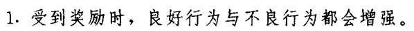 [P26](bookxnotepro://opennote/?nb={1b6f86e1-e6eb-4b4f-8b8f-12cb8f9ff7f8}&book=54aaecb2923ad3219d1b7e4a0b97583b&page=26&x=175&y=206&id=35&uuid=3078e54b99a8745d3465f40e72175312)
        * > 2.及时、经常地奖励孩子的良好行为。 [P26](bookxnotepro://opennote/?nb={1b6f86e1-e6eb-4b4f-8b8f-12cb8f9ff7f8}&book=54aaecb2923ad3219d1b7e4a0b97583b&page=26&x=152&y=224&id=36&uuid=c9d25932157f1431f003a2f8f19872b2)
          
        * > 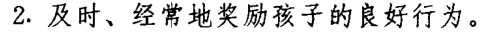 [P26](bookxnotepro://opennote/?nb={1b6f86e1-e6eb-4b4f-8b8f-12cb8f9ff7f8}&book=54aaecb2923ad3219d1b7e4a0b97583b&page=26&x=152&y=224&id=36&uuid=c9d25932157f1431f003a2f8f19872b2)
        * > 3.避免奖励孩子的不良行为。 [P26](bookxnotepro://opennote/?nb={1b6f86e1-e6eb-4b4f-8b8f-12cb8f9ff7f8}&book=54aaecb2923ad3219d1b7e4a0b97583b&page=26&x=134&y=240&id=37&uuid=6eda28266aa148a98c6e5b48f11be403)
          
        * > 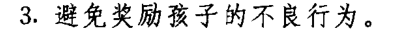 [P26](bookxnotepro://opennote/?nb={1b6f86e1-e6eb-4b4f-8b8f-12cb8f9ff7f8}&book=54aaecb2923ad3219d1b7e4a0b97583b&page=26&x=134&y=240&id=37&uuid=6eda28266aa148a98c6e5b48f11be403)
        * > 4.应用温和的惩罚来减少或消除某些不良行为。 [P26](bookxnotepro://opennote/?nb={1b6f86e1-e6eb-4b4f-8b8f-12cb8f9ff7f8}&book=54aaecb2923ad3219d1b7e4a0b97583b&page=26&x=176&y=256&id=38&uuid=596b1abe77e7ab0d53af3169e25fe757)
          
        * >  [P26](bookxnotepro://opennote/?nb={1b6f86e1-e6eb-4b4f-8b8f-12cb8f9ff7f8}&book=54aaecb2923ad3219d1b7e4a0b97583b&page=26&x=176&y=256&id=38&uuid=596b1abe77e7ab0d53af3169e25fe757)
* > 第二章良好的沟通促进有效地教养孩子 [P27](bookxnotepro://opennote/?nb={1b6f86e1-e6eb-4b4f-8b8f-12cb8f9ff7f8}&book=54aaecb2923ad3219d1b7e4a0b97583b&page=27&x=195&y=105&id=39&uuid=635b748903ed2b9b2370d2b9ede19f4d)
  
* > 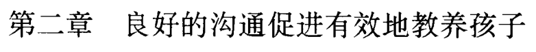 [P27](bookxnotepro://opennote/?nb={1b6f86e1-e6eb-4b4f-8b8f-12cb8f9ff7f8}&book=54aaecb2923ad3219d1b7e4a0b97583b&page=27&x=195&y=105&id=39&uuid=635b748903ed2b9b2370d2b9ede19f4d)
    * > 父母的目标必须一致 [P27](bookxnotepro://opennote/?nb={1b6f86e1-e6eb-4b4f-8b8f-12cb8f9ff7f8}&book=54aaecb2923ad3219d1b7e4a0b97583b&page=27&x=196&y=437&id=40&uuid=0156dcb924ccb58dbd67b35fc2079590)
      
    * > 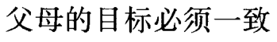 [P27](bookxnotepro://opennote/?nb={1b6f86e1-e6eb-4b4f-8b8f-12cb8f9ff7f8}&book=54aaecb2923ad3219d1b7e4a0b97583b&page=27&x=196&y=437&id=40&uuid=0156dcb924ccb58dbd67b35fc2079590)
        * > 对孩子的同一种行为既奖又罚，导致情绪行为上的混乱 [P28](bookxnotepro://opennote/?nb={1b6f86e1-e6eb-4b4f-8b8f-12cb8f9ff7f8}&book=54aaecb2923ad3219d1b7e4a0b97583b&page=28&x=176&y=440&id=41&uuid=ad243aa151345c250b21c11132850e9c)
          
        * > 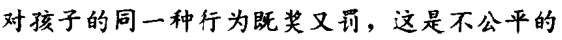 [P28](bookxnotepro://opennote/?nb={1b6f86e1-e6eb-4b4f-8b8f-12cb8f9ff7f8}&book=54aaecb2923ad3219d1b7e4a0b97583b&page=28&x=176&y=440&id=41&uuid=ad243aa151345c250b21c11132850e9c)
        * > 父母双方必须确定哪些行为是可取的，哪些是不可取的 [P28](bookxnotepro://opennote/?nb={1b6f86e1-e6eb-4b4f-8b8f-12cb8f9ff7f8}&book=54aaecb2923ad3219d1b7e4a0b97583b&page=28&x=238&y=457&id=42&uuid=24fd4ca97812cdbb118e6a28dbbc7468)
          
        * > 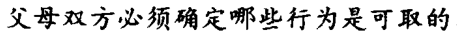 [P28](bookxnotepro://opennote/?nb={1b6f86e1-e6eb-4b4f-8b8f-12cb8f9ff7f8}&book=54aaecb2923ad3219d1b7e4a0b97583b&page=28&x=238&y=457&id=42&uuid=24fd4ca97812cdbb118e6a28dbbc7468)
    * > 父母与孩子间的良好沟通 [P29](bookxnotepro://opennote/?nb={1b6f86e1-e6eb-4b4f-8b8f-12cb8f9ff7f8}&book=54aaecb2923ad3219d1b7e4a0b97583b&page=29&x=194&y=136&id=43&uuid=9b7797e9dc1450637ddb0db7269a6cba)
      
    * > 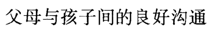 [P29](bookxnotepro://opennote/?nb={1b6f86e1-e6eb-4b4f-8b8f-12cb8f9ff7f8}&book=54aaecb2923ad3219d1b7e4a0b97583b&page=29&x=194&y=136&id=43&uuid=9b7797e9dc1450637ddb0db7269a6cba)
        * > 您和配偶需要共同确定孩子应遵守的规则 [P29](bookxnotepro://opennote/?nb={1b6f86e1-e6eb-4b4f-8b8f-12cb8f9ff7f8}&book=54aaecb2923ad3219d1b7e4a0b97583b&page=29&x=160&y=158&id=46&uuid=f1fab5da2294b1960ce5c62637c66136)
          
        * > 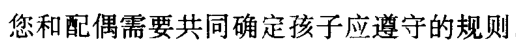 [P29](bookxnotepro://opennote/?nb={1b6f86e1-e6eb-4b4f-8b8f-12cb8f9ff7f8}&book=54aaecb2923ad3219d1b7e4a0b97583b&page=29&x=160&y=158&id=46&uuid=f1fab5da2294b1960ce5c62637c66136)
        * > 孩子参与规则的制定与修改 [P29](bookxnotepro://opennote/?nb={1b6f86e1-e6eb-4b4f-8b8f-12cb8f9ff7f8}&book=54aaecb2923ad3219d1b7e4a0b97583b&page=29&x=119&y=175&id=44&uuid=47e301c8511ab07f001f367e4cb7276f)
          
        * > 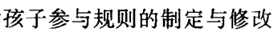 [P29](bookxnotepro://opennote/?nb={1b6f86e1-e6eb-4b4f-8b8f-12cb8f9ff7f8}&book=54aaecb2923ad3219d1b7e4a0b97583b&page=29&x=119&y=175&id=44&uuid=47e301c8511ab07f001f367e4cb7276f)
        * > 不要对孩子说他是个“坏孩子” [P29](bookxnotepro://opennote/?nb={1b6f86e1-e6eb-4b4f-8b8f-12cb8f9ff7f8}&book=54aaecb2923ad3219d1b7e4a0b97583b&page=29&x=240&y=223&id=47&uuid=2c7141258ea0263774a25600ab0f146e)
          
        * > 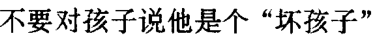 [P29](bookxnotepro://opennote/?nb={1b6f86e1-e6eb-4b4f-8b8f-12cb8f9ff7f8}&book=54aaecb2923ad3219d1b7e4a0b97583b&page=29&x=240&y=223&id=47&uuid=2c7141258ea0263774a25600ab0f146e)
        * > 要告诉他哪些行为是不能接受 [P29](bookxnotepro://opennote/?nb={1b6f86e1-e6eb-4b4f-8b8f-12cb8f9ff7f8}&book=54aaecb2923ad3219d1b7e4a0b97583b&page=29&x=124&y=238&id=45&uuid=54aee9fbb2cddb75a3da5d939e9e5e86)
          
        * > 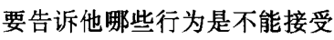 [P29](bookxnotepro://opennote/?nb={1b6f86e1-e6eb-4b4f-8b8f-12cb8f9ff7f8}&book=54aaecb2923ad3219d1b7e4a0b97583b&page=29&x=124&y=238&id=45&uuid=54aee9fbb2cddb75a3da5d939e9e5e86)
    * > 如何下达有效的命令 [P29](bookxnotepro://opennote/?nb={1b6f86e1-e6eb-4b4f-8b8f-12cb8f9ff7f8}&book=54aaecb2923ad3219d1b7e4a0b97583b&page=29&x=193&y=485&id=48&uuid=2b41a5a1e28bb19ee89726c3c5217d2c)
      
    * > 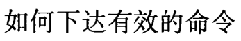 [P29](bookxnotepro://opennote/?nb={1b6f86e1-e6eb-4b4f-8b8f-12cb8f9ff7f8}&book=54aaecb2923ad3219d1b7e4a0b97583b&page=29&x=193&y=485&id=48&uuid=2b41a5a1e28bb19ee89726c3c5217d2c)
        * > 要求 [P29](bookxnotepro://opennote/?nb={1b6f86e1-e6eb-4b4f-8b8f-12cb8f9ff7f8}&book=54aaecb2923ad3219d1b7e4a0b97583b&page=29&x=230&y=508&id=49&uuid=7df1a7b645da003b86041624fc47d463)
          
        * > 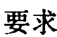 [P29](bookxnotepro://opennote/?nb={1b6f86e1-e6eb-4b4f-8b8f-12cb8f9ff7f8}&book=54aaecb2923ad3219d1b7e4a0b97583b&page=29&x=230&y=508&id=49&uuid=7df1a7b645da003b86041624fc47d463)
            * > “请把玩具捡起来！” [P29](bookxnotepro://opennote/?nb={1b6f86e1-e6eb-4b4f-8b8f-12cb8f9ff7f8}&book=54aaecb2923ad3219d1b7e4a0b97583b&page=29&x=111&y=508&id=51&uuid=7b9b9aa30c26f9270c6106991fc37c99)
              
            * > 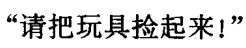 [P29](bookxnotepro://opennote/?nb={1b6f86e1-e6eb-4b4f-8b8f-12cb8f9ff7f8}&book=54aaecb2923ad3219d1b7e4a0b97583b&page=29&x=111&y=508&id=51&uuid=7b9b9aa30c26f9270c6106991fc37c99)
        * > 命令 [P30](bookxnotepro://opennote/?nb={1b6f86e1-e6eb-4b4f-8b8f-12cb8f9ff7f8}&book=54aaecb2923ad3219d1b7e4a0b97583b&page=30&x=224&y=72&id=50&uuid=7e43cace5fe85ece4d458128ed75a169)
          
        * > 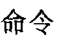 [P30](bookxnotepro://opennote/?nb={1b6f86e1-e6eb-4b4f-8b8f-12cb8f9ff7f8}&book=54aaecb2923ad3219d1b7e4a0b97583b&page=30&x=224&y=72&id=50&uuid=7e43cace5fe85ece4d458128ed75a169)
            * > “不要乱扔食物！” [P29](bookxnotepro://opennote/?nb={1b6f86e1-e6eb-4b4f-8b8f-12cb8f9ff7f8}&book=54aaecb2923ad3219d1b7e4a0b97583b&page=29&x=289&y=509&id=52&uuid=8af57b79a7fea66cd91c95469ad27e86)
              
            * > 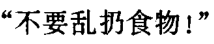 [P29](bookxnotepro://opennote/?nb={1b6f86e1-e6eb-4b4f-8b8f-12cb8f9ff7f8}&book=54aaecb2923ad3219d1b7e4a0b97583b&page=29&x=289&y=509&id=52&uuid=8af57b79a7fea66cd91c95469ad27e86)
            * > “过来把扔在地上的夹克挂好！” [P30](bookxnotepro://opennote/?nb={1b6f86e1-e6eb-4b4f-8b8f-12cb8f9ff7f8}&book=54aaecb2923ad3219d1b7e4a0b97583b&page=30&x=116&y=71&id=53&uuid=10829d395e76ac2378c5b274ee4ab8bb)
              
            * > 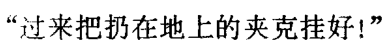 [P30](bookxnotepro://opennote/?nb={1b6f86e1-e6eb-4b4f-8b8f-12cb8f9ff7f8}&book=54aaecb2923ad3219d1b7e4a0b97583b&page=30&x=116&y=71&id=53&uuid=10829d395e76ac2378c5b274ee4ab8bb)
        * > 下达清楚、有效的指示或命令 [P30](bookxnotepro://opennote/?nb={1b6f86e1-e6eb-4b4f-8b8f-12cb8f9ff7f8}&book=54aaecb2923ad3219d1b7e4a0b97583b&page=30&x=208&y=121&id=54&uuid=ac9a12b8cebfd70e90d9b2668e67b274)
          
        * > 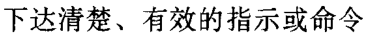 [P30](bookxnotepro://opennote/?nb={1b6f86e1-e6eb-4b4f-8b8f-12cb8f9ff7f8}&book=54aaecb2923ad3219d1b7e4a0b97583b&page=30&x=208&y=121&id=54&uuid=ac9a12b8cebfd70e90d9b2668e67b274)
        * > 下达命令时，不要用提问或间接评价的方式 [P30](bookxnotepro://opennote/?nb={1b6f86e1-e6eb-4b4f-8b8f-12cb8f9ff7f8}&book=54aaecb2923ad3219d1b7e4a0b97583b&page=30&x=189&y=390&id=55&uuid=0544bd004c05471f5c19f93b69c82f33)
          
        * > 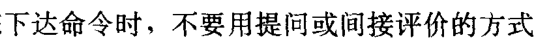 [P30](bookxnotepro://opennote/?nb={1b6f86e1-e6eb-4b4f-8b8f-12cb8f9ff7f8}&book=54aaecb2923ad3219d1b7e4a0b97583b&page=30&x=189&y=390&id=55&uuid=0544bd004c05471f5c19f93b69c82f33)
            * ###### NO
              > “为什么你在沙发上蹦跳？” [P30](bookxnotepro://opennote/?nb={1b6f86e1-e6eb-4b4f-8b8f-12cb8f9ff7f8}&book=54aaecb2923ad3219d1b7e4a0b97583b&page=30&x=281&y=407&id=58&uuid=9fbb1027d080db47b049f56683883ce1)
              
              > 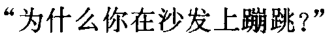 [P30](bookxnotepro://opennote/?nb={1b6f86e1-e6eb-4b4f-8b8f-12cb8f9ff7f8}&book=54aaecb2923ad3219d1b7e4a0b97583b&page=30&x=281&y=407&id=58&uuid=9fbb1027d080db47b049f56683883ce1)
            * ###### NO
              > 沙发上蹦跳是不好的 [P30](bookxnotepro://opennote/?nb={1b6f86e1-e6eb-4b4f-8b8f-12cb8f9ff7f8}&book=54aaecb2923ad3219d1b7e4a0b97583b&page=30&x=89&y=406&id=59&uuid=87f12c24d07bf2c95cfe8cadeff75967)
              
              > 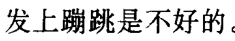 [P30](bookxnotepro://opennote/?nb={1b6f86e1-e6eb-4b4f-8b8f-12cb8f9ff7f8}&book=54aaecb2923ad3219d1b7e4a0b97583b&page=30&x=89&y=406&id=59&uuid=87f12c24d07bf2c95cfe8cadeff75967)
        * > 当不良行为发生时，不必解释为何要遵守规定 [P30](bookxnotepro://opennote/?nb={1b6f86e1-e6eb-4b4f-8b8f-12cb8f9ff7f8}&book=54aaecb2923ad3219d1b7e4a0b97583b&page=30&x=203&y=438&id=56&uuid=c8067fa19ce4ac7a30307a616ba9e0ef)
          
        * > 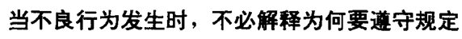 [P30](bookxnotepro://opennote/?nb={1b6f86e1-e6eb-4b4f-8b8f-12cb8f9ff7f8}&book=54aaecb2923ad3219d1b7e4a0b97583b&page=30&x=203&y=438&id=56&uuid=c8067fa19ce4ac7a30307a616ba9e0ef)
            * ###### YES
              > “从沙发上下来！” [P30](bookxnotepro://opennote/?nb={1b6f86e1-e6eb-4b4f-8b8f-12cb8f9ff7f8}&book=54aaecb2923ad3219d1b7e4a0b97583b&page=30&x=140&y=501&id=57&uuid=cb9e0a1f945cd219e58de54ef24d7470)
              
              > 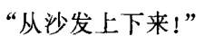 [P30](bookxnotepro://opennote/?nb={1b6f86e1-e6eb-4b4f-8b8f-12cb8f9ff7f8}&book=54aaecb2923ad3219d1b7e4a0b97583b&page=30&x=140&y=501&id=57&uuid=cb9e0a1f945cd219e58de54ef24d7470)
    * > 孩子需要纪律约束与爱 [P31](bookxnotepro://opennote/?nb={1b6f86e1-e6eb-4b4f-8b8f-12cb8f9ff7f8}&book=54aaecb2923ad3219d1b7e4a0b97583b&page=31&x=191&y=386&id=60&uuid=03caf783b3c018f7694b57d53eb0cc38)
      
    * > 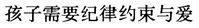 [P31](bookxnotepro://opennote/?nb={1b6f86e1-e6eb-4b4f-8b8f-12cb8f9ff7f8}&book=54aaecb2923ad3219d1b7e4a0b97583b&page=31&x=191&y=386&id=60&uuid=03caf783b3c018f7694b57d53eb0cc38)
        * > 自我控制 [P31](bookxnotepro://opennote/?nb={1b6f86e1-e6eb-4b4f-8b8f-12cb8f9ff7f8}&book=54aaecb2923ad3219d1b7e4a0b97583b&page=31&x=192&y=409&id=61&uuid=15d309f444e4c41f00509e5b7739aa70)
          
        * > 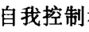 [P31](bookxnotepro://opennote/?nb={1b6f86e1-e6eb-4b4f-8b8f-12cb8f9ff7f8}&book=54aaecb2923ad3219d1b7e4a0b97583b&page=31&x=192&y=409&id=61&uuid=15d309f444e4c41f00509e5b7739aa70)
        * > 改善行为 [P31](bookxnotepro://opennote/?nb={1b6f86e1-e6eb-4b4f-8b8f-12cb8f9ff7f8}&book=54aaecb2923ad3219d1b7e4a0b97583b&page=31&x=244&y=409&id=62&uuid=68d78a491ed554fe838830a429328218)
          
        * > 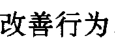 [P31](bookxnotepro://opennote/?nb={1b6f86e1-e6eb-4b4f-8b8f-12cb8f9ff7f8}&book=54aaecb2923ad3219d1b7e4a0b97583b&page=31&x=244&y=409&id=62&uuid=68d78a491ed554fe838830a429328218)
    * > 父母未能管教孩子的原因 [P32](bookxnotepro://opennote/?nb={1b6f86e1-e6eb-4b4f-8b8f-12cb8f9ff7f8}&book=54aaecb2923ad3219d1b7e4a0b97583b&page=32&x=194&y=288&id=63&uuid=d89d9f79435e880c08d0068c01f30b6b)
      
    * > 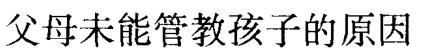 [P32](bookxnotepro://opennote/?nb={1b6f86e1-e6eb-4b4f-8b8f-12cb8f9ff7f8}&book=54aaecb2923ad3219d1b7e4a0b97583b&page=32&x=194&y=288&id=63&uuid=d89d9f79435e880c08d0068c01f30b6b)
        * > 放弃对孩子的管教 [P32](bookxnotepro://opennote/?nb={1b6f86e1-e6eb-4b4f-8b8f-12cb8f9ff7f8}&book=54aaecb2923ad3219d1b7e4a0b97583b&page=32&x=194&y=392&id=64&uuid=a5734500ca058400ab1f088e03e87d68)
          
        * > 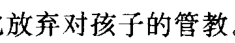 [P32](bookxnotepro://opennote/?nb={1b6f86e1-e6eb-4b4f-8b8f-12cb8f9ff7f8}&book=54aaecb2923ad3219d1b7e4a0b97583b&page=32&x=194&y=392&id=64&uuid=a5734500ca058400ab1f088e03e87d68)
        * > 避免与孩子对立 [P33](bookxnotepro://opennote/?nb={1b6f86e1-e6eb-4b4f-8b8f-12cb8f9ff7f8}&book=54aaecb2923ad3219d1b7e4a0b97583b&page=33&x=249&y=188&id=65&uuid=28321e07a5d8d2a72888d1fd14e87951)
          
        * > 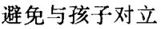 [P33](bookxnotepro://opennote/?nb={1b6f86e1-e6eb-4b4f-8b8f-12cb8f9ff7f8}&book=54aaecb2923ad3219d1b7e4a0b97583b&page=33&x=249&y=188&id=65&uuid=28321e07a5d8d2a72888d1fd14e87951)
        * > 没有足够的精力 [P33](bookxnotepro://opennote/?nb={1b6f86e1-e6eb-4b4f-8b8f-12cb8f9ff7f8}&book=54aaecb2923ad3219d1b7e4a0b97583b&page=33&x=292&y=251&id=66&uuid=c46c779b5d99c8b42a8a4b79e49965c8)
          
        * > 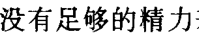 [P33](bookxnotepro://opennote/?nb={1b6f86e1-e6eb-4b4f-8b8f-12cb8f9ff7f8}&book=54aaecb2923ad3219d1b7e4a0b97583b&page=33&x=292&y=251&id=66&uuid=c46c779b5d99c8b42a8a4b79e49965c8)
        * > 自责与内疚阻止了父母去教育孩子 [P34](bookxnotepro://opennote/?nb={1b6f86e1-e6eb-4b4f-8b8f-12cb8f9ff7f8}&book=54aaecb2923ad3219d1b7e4a0b97583b&page=34&x=263&y=117&id=67&uuid=f42a2e3deb22f6bc4e6cca1596bab17e)
          
        * > 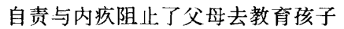 [P34](bookxnotepro://opennote/?nb={1b6f86e1-e6eb-4b4f-8b8f-12cb8f9ff7f8}&book=54aaecb2923ad3219d1b7e4a0b97583b&page=34&x=263&y=117&id=67&uuid=f42a2e3deb22f6bc4e6cca1596bab17e)
        * > 以免动怒 [P34](bookxnotepro://opennote/?nb={1b6f86e1-e6eb-4b4f-8b8f-12cb8f9ff7f8}&book=54aaecb2923ad3219d1b7e4a0b97583b&page=34&x=205&y=179&id=68&uuid=a744a9f34e35dc6c693de88ce2e0fd7a)
          
        * > 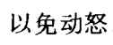 [P34](bookxnotepro://opennote/?nb={1b6f86e1-e6eb-4b4f-8b8f-12cb8f9ff7f8}&book=54aaecb2923ad3219d1b7e4a0b97583b&page=34&x=205&y=179&id=68&uuid=a744a9f34e35dc6c693de88ce2e0fd7a)
        * > 相互妨碍的父母 [P34](bookxnotepro://opennote/?nb={1b6f86e1-e6eb-4b4f-8b8f-12cb8f9ff7f8}&book=54aaecb2923ad3219d1b7e4a0b97583b&page=34&x=116&y=210&id=69&uuid=29d298fb595fc2ba6053e1bd5a6bd0a1)
          
        * > 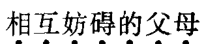 [P34](bookxnotepro://opennote/?nb={1b6f86e1-e6eb-4b4f-8b8f-12cb8f9ff7f8}&book=54aaecb2923ad3219d1b7e4a0b97583b&page=34&x=116&y=210&id=69&uuid=29d298fb595fc2ba6053e1bd5a6bd0a1)
        * > 困境中的父母 [P34](bookxnotepro://opennote/?nb={1b6f86e1-e6eb-4b4f-8b8f-12cb8f9ff7f8}&book=54aaecb2923ad3219d1b7e4a0b97583b&page=34&x=110&y=302&id=70&uuid=fccad55c621502bc2d726051451ec273)
          
        * > 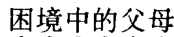 [P34](bookxnotepro://opennote/?nb={1b6f86e1-e6eb-4b4f-8b8f-12cb8f9ff7f8}&book=54aaecb2923ad3219d1b7e4a0b97583b&page=34&x=110&y=302&id=70&uuid=fccad55c621502bc2d726051451ec273)
    * > 要点 [P34](bookxnotepro://opennote/?nb={1b6f86e1-e6eb-4b4f-8b8f-12cb8f9ff7f8}&book=54aaecb2923ad3219d1b7e4a0b97583b&page=34&x=122&y=410&id=71&uuid=64e9965d34be29cdb439397da2a6edff)
      
    * > 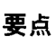 [P34](bookxnotepro://opennote/?nb={1b6f86e1-e6eb-4b4f-8b8f-12cb8f9ff7f8}&book=54aaecb2923ad3219d1b7e4a0b97583b&page=34&x=122&y=410&id=71&uuid=64e9965d34be29cdb439397da2a6edff)
        * > 1.孩子的何种行为是可取的、何种行为是不可取的，父母对此应达成一致。 [P34](bookxnotepro://opennote/?nb={1b6f86e1-e6eb-4b4f-8b8f-12cb8f9ff7f8}&book=54aaecb2923ad3219d1b7e4a0b97583b&page=34&x=196&y=435&id=72&uuid=82320c686fd67ff926a89f75e6af8974)
          
        * > 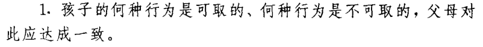 [P34](bookxnotepro://opennote/?nb={1b6f86e1-e6eb-4b4f-8b8f-12cb8f9ff7f8}&book=54aaecb2923ad3219d1b7e4a0b97583b&page=34&x=196&y=435&id=72&uuid=82320c686fd67ff926a89f75e6af8974)
        * > 2.与孩子有良好、明确的沟通。 [P34](bookxnotepro://opennote/?nb={1b6f86e1-e6eb-4b4f-8b8f-12cb8f9ff7f8}&book=54aaecb2923ad3219d1b7e4a0b97583b&page=34&x=144&y=458&id=73&uuid=cf64708cb5c94a5d9314c42c08ab8a5e)
          
        * > 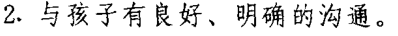 [P34](bookxnotepro://opennote/?nb={1b6f86e1-e6eb-4b4f-8b8f-12cb8f9ff7f8}&book=54aaecb2923ad3219d1b7e4a0b97583b&page=34&x=144&y=458&id=73&uuid=cf64708cb5c94a5d9314c42c08ab8a5e)
        * > 3.能够下达清楚、有效的命令。 [P34](bookxnotepro://opennote/?nb={1b6f86e1-e6eb-4b4f-8b8f-12cb8f9ff7f8}&book=54aaecb2923ad3219d1b7e4a0b97583b&page=34&x=143&y=474&id=74&uuid=7a473703c0b51849f3f4d59c90c61845)
          
        * > 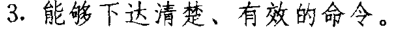 [P34](bookxnotepro://opennote/?nb={1b6f86e1-e6eb-4b4f-8b8f-12cb8f9ff7f8}&book=54aaecb2923ad3219d1b7e4a0b97583b&page=34&x=143&y=474&id=74&uuid=7a473703c0b51849f3f4d59c90c61845)
        * > 4.孩子需要爱，也需要纪律的约束与惩戒。若您管教孩子时受阻，要查明原因并予以解决。 [P34](bookxnotepro://opennote/?nb={1b6f86e1-e6eb-4b4f-8b8f-12cb8f9ff7f8}&book=54aaecb2923ad3219d1b7e4a0b97583b&page=34&x=196&y=497&id=75&uuid=ebfddb7a1835a4dd9b38cb2b2bb90113)
          
        * > 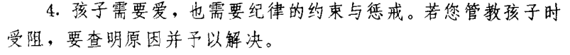 [P34](bookxnotepro://opennote/?nb={1b6f86e1-e6eb-4b4f-8b8f-12cb8f9ff7f8}&book=54aaecb2923ad3219d1b7e4a0b97583b&page=34&x=196&y=497&id=75&uuid=ebfddb7a1835a4dd9b38cb2b2bb90113)
* > 第三章增进良好行为的方式 [P35](bookxnotepro://opennote/?nb={1b6f86e1-e6eb-4b4f-8b8f-12cb8f9ff7f8}&book=54aaecb2923ad3219d1b7e4a0b97583b&page=35&x=212&y=98&id=76&uuid=1d293955a338c385f4e7ba09c7c55c27)
  
* >  [P35](bookxnotepro://opennote/?nb={1b6f86e1-e6eb-4b4f-8b8f-12cb8f9ff7f8}&book=54aaecb2923ad3219d1b7e4a0b97583b&page=35&x=212&y=98&id=76&uuid=1d293955a338c385f4e7ba09c7c55c27)
    * > 故意忽视 [P36](bookxnotepro://opennote/?nb={1b6f86e1-e6eb-4b4f-8b8f-12cb8f9ff7f8}&book=54aaecb2923ad3219d1b7e4a0b97583b&page=36&x=195&y=84&id=77&uuid=aed7209e9e0e3033b3c2da88eab3071a)
      
    * >  [P36](bookxnotepro://opennote/?nb={1b6f86e1-e6eb-4b4f-8b8f-12cb8f9ff7f8}&book=54aaecb2923ad3219d1b7e4a0b97583b&page=36&x=195&y=84&id=77&uuid=aed7209e9e0e3033b3c2da88eab3071a)
        * > 将注意力从孩子的不良行为上移开 [P36](bookxnotepro://opennote/?nb={1b6f86e1-e6eb-4b4f-8b8f-12cb8f9ff7f8}&book=54aaecb2923ad3219d1b7e4a0b97583b&page=36&x=211&y=413&id=78&uuid=524a3eca82943e387a0cc558fe2caaf3)
          
        * >  [P36](bookxnotepro://opennote/?nb={1b6f86e1-e6eb-4b4f-8b8f-12cb8f9ff7f8}&book=54aaecb2923ad3219d1b7e4a0b97583b&page=36&x=211&y=413&id=78&uuid=524a3eca82943e387a0cc558fe2caaf3)
        * > 不良行为 [P37](bookxnotepro://opennote/?nb={1b6f86e1-e6eb-4b4f-8b8f-12cb8f9ff7f8}&book=54aaecb2923ad3219d1b7e4a0b97583b&page=37&x=258&y=357&id=79&uuid=b5808f9f1f3be40a9e5ec5f679034ca6)
          
        * >  [P37](bookxnotepro://opennote/?nb={1b6f86e1-e6eb-4b4f-8b8f-12cb8f9ff7f8}&book=54aaecb2923ad3219d1b7e4a0b97583b&page=37&x=258&y=357&id=79&uuid=b5808f9f1f3be40a9e5ec5f679034ca6)
            * > ·哭哭啼啼和烦躁 [P37](bookxnotepro://opennote/?nb={1b6f86e1-e6eb-4b4f-8b8f-12cb8f9ff7f8}&book=54aaecb2923ad3219d1b7e4a0b97583b&page=37&x=111&y=374&id=80&uuid=395bbd3d9e3e4033ea15ca31c1ee0e28)
              
            * >  [P37](bookxnotepro://opennote/?nb={1b6f86e1-e6eb-4b4f-8b8f-12cb8f9ff7f8}&book=54aaecb2923ad3219d1b7e4a0b97583b&page=37&x=111&y=374&id=80&uuid=395bbd3d9e3e4033ea15ca31c1ee0e28)
            * > ·撅嘴板脸和生气 [P37](bookxnotepro://opennote/?nb={1b6f86e1-e6eb-4b4f-8b8f-12cb8f9ff7f8}&book=54aaecb2923ad3219d1b7e4a0b97583b&page=37&x=111&y=391&id=81&uuid=18466f005aed03a8992c7c4d3631eb80)
              
            * >  [P37](bookxnotepro://opennote/?nb={1b6f86e1-e6eb-4b4f-8b8f-12cb8f9ff7f8}&book=54aaecb2923ad3219d1b7e4a0b97583b&page=37&x=111&y=391&id=81&uuid=18466f005aed03a8992c7c4d3631eb80)
            * > ·以惩罚父母为目的的大声哭叫 [P37](bookxnotepro://opennote/?nb={1b6f86e1-e6eb-4b4f-8b8f-12cb8f9ff7f8}&book=54aaecb2923ad3219d1b7e4a0b97583b&page=37&x=145&y=407&id=82&uuid=5193917e8d780bcc9425eb07d06b2b0a)
              
            * >  [P37](bookxnotepro://opennote/?nb={1b6f86e1-e6eb-4b4f-8b8f-12cb8f9ff7f8}&book=54aaecb2923ad3219d1b7e4a0b97583b&page=37&x=145&y=407&id=82&uuid=5193917e8d780bcc9425eb07d06b2b0a)
            * > ·无理取闹 [P37](bookxnotepro://opennote/?nb={1b6f86e1-e6eb-4b4f-8b8f-12cb8f9ff7f8}&book=54aaecb2923ad3219d1b7e4a0b97583b&page=37&x=99&y=422&id=83&uuid=6b7fe413157168e81c7b3fa31305dea4)
              
            * >  [P37](bookxnotepro://opennote/?nb={1b6f86e1-e6eb-4b4f-8b8f-12cb8f9ff7f8}&book=54aaecb2923ad3219d1b7e4a0b97583b&page=37&x=99&y=422&id=83&uuid=6b7fe413157168e81c7b3fa31305dea4)
            * > ·不停地哀求、要求 [P37](bookxnotepro://opennote/?nb={1b6f86e1-e6eb-4b4f-8b8f-12cb8f9ff7f8}&book=54aaecb2923ad3219d1b7e4a0b97583b&page=37&x=117&y=439&id=84&uuid=35ef205e2f2653090fa54d2dbacb9429)
              
            * >  [P37](bookxnotepro://opennote/?nb={1b6f86e1-e6eb-4b4f-8b8f-12cb8f9ff7f8}&book=54aaecb2923ad3219d1b7e4a0b97583b&page=37&x=117&y=439&id=84&uuid=35ef205e2f2653090fa54d2dbacb9429)
            * > ·憋气、轻微发脾气 [P37](bookxnotepro://opennote/?nb={1b6f86e1-e6eb-4b4f-8b8f-12cb8f9ff7f8}&book=54aaecb2923ad3219d1b7e4a0b97583b&page=37&x=116&y=453&id=85&uuid=f7dba1b2378793cfd1c85adbfc4277d4)
              
            * >  [P37](bookxnotepro://opennote/?nb={1b6f86e1-e6eb-4b4f-8b8f-12cb8f9ff7f8}&book=54aaecb2923ad3219d1b7e4a0b97583b&page=37&x=116&y=453&id=85&uuid=f7dba1b2378793cfd1c85adbfc4277d4)
    * > 帮助孩子练习良好行为 [P39](bookxnotepro://opennote/?nb={1b6f86e1-e6eb-4b4f-8b8f-12cb8f9ff7f8}&book=54aaecb2923ad3219d1b7e4a0b97583b&page=39&x=191&y=112&id=100&uuid=5a4d44a4e46f5101bb606ff4ef29e5b1)
      
    * >  [P39](bookxnotepro://opennote/?nb={1b6f86e1-e6eb-4b4f-8b8f-12cb8f9ff7f8}&book=54aaecb2923ad3219d1b7e4a0b97583b&page=39&x=191&y=112&id=100&uuid=5a4d44a4e46f5101bb606ff4ef29e5b1)
        * > 示范 [P39](bookxnotepro://opennote/?nb={1b6f86e1-e6eb-4b4f-8b8f-12cb8f9ff7f8}&book=54aaecb2923ad3219d1b7e4a0b97583b&page=39&x=54&y=342&id=94&uuid=4d1ef21f788c9d1a4feed99d235c6363)
          
        * >  [P39](bookxnotepro://opennote/?nb={1b6f86e1-e6eb-4b4f-8b8f-12cb8f9ff7f8}&book=54aaecb2923ad3219d1b7e4a0b97583b&page=39&x=54&y=342&id=94&uuid=4d1ef21f788c9d1a4feed99d235c6363)
        * > 练习 [P39](bookxnotepro://opennote/?nb={1b6f86e1-e6eb-4b4f-8b8f-12cb8f9ff7f8}&book=54aaecb2923ad3219d1b7e4a0b97583b&page=39&x=138&y=342&id=95&uuid=228d0c56935af2933e84e749e008f6d0)
          
        * >  [P39](bookxnotepro://opennote/?nb={1b6f86e1-e6eb-4b4f-8b8f-12cb8f9ff7f8}&book=54aaecb2923ad3219d1b7e4a0b97583b&page=39&x=138&y=342&id=95&uuid=228d0c56935af2933e84e749e008f6d0)
        * > 成功地交换 [P39](bookxnotepro://opennote/?nb={1b6f86e1-e6eb-4b4f-8b8f-12cb8f9ff7f8}&book=54aaecb2923ad3219d1b7e4a0b97583b&page=39&x=249&y=341&id=96&uuid=9c334e1feca7b477c8e7577815defe55)
          
        * >  [P39](bookxnotepro://opennote/?nb={1b6f86e1-e6eb-4b4f-8b8f-12cb8f9ff7f8}&book=54aaecb2923ad3219d1b7e4a0b97583b&page=39&x=249&y=341&id=96&uuid=9c334e1feca7b477c8e7577815defe55)
            * > 表扬 [P39](bookxnotepro://opennote/?nb={1b6f86e1-e6eb-4b4f-8b8f-12cb8f9ff7f8}&book=54aaecb2923ad3219d1b7e4a0b97583b&page=39&x=120&y=357&id=97&uuid=376e82776f76817ef24b99e179316163)
              
            * >  [P39](bookxnotepro://opennote/?nb={1b6f86e1-e6eb-4b4f-8b8f-12cb8f9ff7f8}&book=54aaecb2923ad3219d1b7e4a0b97583b&page=39&x=120&y=357&id=97&uuid=376e82776f76817ef24b99e179316163)
        * > 抢玩具 [P39](bookxnotepro://opennote/?nb={1b6f86e1-e6eb-4b4f-8b8f-12cb8f9ff7f8}&book=54aaecb2923ad3219d1b7e4a0b97583b&page=39&x=172&y=357&id=98&uuid=ff28830198e1ed87f54aa0ddd136e204)
          
        * >  [P39](bookxnotepro://opennote/?nb={1b6f86e1-e6eb-4b4f-8b8f-12cb8f9ff7f8}&book=54aaecb2923ad3219d1b7e4a0b97583b&page=39&x=172&y=357&id=98&uuid=ff28830198e1ed87f54aa0ddd136e204)
            * > 训斥 [P39](bookxnotepro://opennote/?nb={1b6f86e1-e6eb-4b4f-8b8f-12cb8f9ff7f8}&book=54aaecb2923ad3219d1b7e4a0b97583b&page=39&x=237&y=358&id=99&uuid=071fc1acc20a192a7ffb0f7a71bafd75)
              
            * >  [P39](bookxnotepro://opennote/?nb={1b6f86e1-e6eb-4b4f-8b8f-12cb8f9ff7f8}&book=54aaecb2923ad3219d1b7e4a0b97583b&page=39&x=237&y=358&id=99&uuid=071fc1acc20a192a7ffb0f7a71bafd75)
    * > 祖母原则 [P39](bookxnotepro://opennote/?nb={1b6f86e1-e6eb-4b4f-8b8f-12cb8f9ff7f8}&book=54aaecb2923ad3219d1b7e4a0b97583b&page=39&x=207&y=445&id=101&uuid=f7d402f9e75b998b6453837c09ccfa43)
      
    * >  [P39](bookxnotepro://opennote/?nb={1b6f86e1-e6eb-4b4f-8b8f-12cb8f9ff7f8}&book=54aaecb2923ad3219d1b7e4a0b97583b&page=39&x=207&y=445&id=101&uuid=f7d402f9e75b998b6453837c09ccfa43)
        * > “在你做完家务之后，你才可以去玩。” [P40](bookxnotepro://opennote/?nb={1b6f86e1-e6eb-4b4f-8b8f-12cb8f9ff7f8}&book=54aaecb2923ad3219d1b7e4a0b97583b&page=40&x=177&y=75&id=102&uuid=f4f851c20c30bbb20e5a121f974457c9)
          
        * >  [P40](bookxnotepro://opennote/?nb={1b6f86e1-e6eb-4b4f-8b8f-12cb8f9ff7f8}&book=54aaecb2923ad3219d1b7e4a0b97583b&page=40&x=177&y=75&id=102&uuid=f4f851c20c30bbb20e5a121f974457c9)
        * > 完成工作再给奖励 [P40](bookxnotepro://opennote/?nb={1b6f86e1-e6eb-4b4f-8b8f-12cb8f9ff7f8}&book=54aaecb2923ad3219d1b7e4a0b97583b&page=40&x=91&y=394&id=105&uuid=d598d9c9f8aed6aac0b7811fad9c26f1)
          
        * >  [P40](bookxnotepro://opennote/?nb={1b6f86e1-e6eb-4b4f-8b8f-12cb8f9ff7f8}&book=54aaecb2923ad3219d1b7e4a0b97583b&page=40&x=91&y=394&id=105&uuid=d598d9c9f8aed6aac0b7811fad9c26f1)
    * > 树立良好的榜样 [P40](bookxnotepro://opennote/?nb={1b6f86e1-e6eb-4b4f-8b8f-12cb8f9ff7f8}&book=54aaecb2923ad3219d1b7e4a0b97583b&page=40&x=194&y=450&id=106&uuid=51ace6c84b1d0affd39e44859f122dd5)
      
    * >  [P40](bookxnotepro://opennote/?nb={1b6f86e1-e6eb-4b4f-8b8f-12cb8f9ff7f8}&book=54aaecb2923ad3219d1b7e4a0b97583b&page=40&x=194&y=450&id=106&uuid=51ace6c84b1d0affd39e44859f122dd5)
        * > 观察父母 [P41](bookxnotepro://opennote/?nb={1b6f86e1-e6eb-4b4f-8b8f-12cb8f9ff7f8}&book=54aaecb2923ad3219d1b7e4a0b97583b&page=41&x=245&y=360&id=108&uuid=ea51cd700b9f32ffa14d212dd36f024d)
          
        * >  [P41](bookxnotepro://opennote/?nb={1b6f86e1-e6eb-4b4f-8b8f-12cb8f9ff7f8}&book=54aaecb2923ad3219d1b7e4a0b97583b&page=41&x=245&y=360&id=108&uuid=ea51cd700b9f32ffa14d212dd36f024d)
        * > 从电视、电影中的人物身上学会某些行为 [P41](bookxnotepro://opennote/?nb={1b6f86e1-e6eb-4b4f-8b8f-12cb8f9ff7f8}&book=54aaecb2923ad3219d1b7e4a0b97583b&page=41&x=228&y=409&id=107&uuid=6dc898285be5e93fde5b8b045fcfcdb5)
          
        * >  [P41](bookxnotepro://opennote/?nb={1b6f86e1-e6eb-4b4f-8b8f-12cb8f9ff7f8}&book=54aaecb2923ad3219d1b7e4a0b97583b&page=41&x=228&y=409&id=107&uuid=6dc898285be5e93fde5b8b045fcfcdb5)
    * > 要点 [P43](bookxnotepro://opennote/?nb={1b6f86e1-e6eb-4b4f-8b8f-12cb8f9ff7f8}&book=54aaecb2923ad3219d1b7e4a0b97583b&page=43&x=116&y=116&id=109&uuid=914aae9fdc192d0fd8747e597d046d39)
      
    * >  [P43](bookxnotepro://opennote/?nb={1b6f86e1-e6eb-4b4f-8b8f-12cb8f9ff7f8}&book=54aaecb2923ad3219d1b7e4a0b97583b&page=43&x=116&y=116&id=109&uuid=914aae9fdc192d0fd8747e597d046d39)
        * > 1.鼓励和表扬孩子的良好行为。 [P43](bookxnotepro://opennote/?nb={1b6f86e1-e6eb-4b4f-8b8f-12cb8f9ff7f8}&book=54aaecb2923ad3219d1b7e4a0b97583b&page=43&x=137&y=134&id=110&uuid=ff4bc040508667b8c7f772adc6f31b43)
          
        * >  [P43](bookxnotepro://opennote/?nb={1b6f86e1-e6eb-4b4f-8b8f-12cb8f9ff7f8}&book=54aaecb2923ad3219d1b7e4a0b97583b&page=43&x=137&y=134&id=110&uuid=ff4bc040508667b8c7f772adc6f31b43)
        * > 2.故意忽视某些不良行为。 [P43](bookxnotepro://opennote/?nb={1b6f86e1-e6eb-4b4f-8b8f-12cb8f9ff7f8}&book=54aaecb2923ad3219d1b7e4a0b97583b&page=43&x=126&y=149&id=111&uuid=1c0e65a85c7ee3db2c9349dc61348e58)
          
        * >  [P43](bookxnotepro://opennote/?nb={1b6f86e1-e6eb-4b4f-8b8f-12cb8f9ff7f8}&book=54aaecb2923ad3219d1b7e4a0b97583b&page=43&x=126&y=149&id=111&uuid=1c0e65a85c7ee3db2c9349dc61348e58)
        * > 3.确定某种不可取的行为后，奖励相应的良好的替代行为。 [P43](bookxnotepro://opennote/?nb={1b6f86e1-e6eb-4b4f-8b8f-12cb8f9ff7f8}&book=54aaecb2923ad3219d1b7e4a0b97583b&page=43&x=200&y=166&id=112&uuid=268caf5ab4d513d13b9ccdc3f344bb2f)
          
        * >  [P43](bookxnotepro://opennote/?nb={1b6f86e1-e6eb-4b4f-8b8f-12cb8f9ff7f8}&book=54aaecb2923ad3219d1b7e4a0b97583b&page=43&x=200&y=166&id=112&uuid=268caf5ab4d513d13b9ccdc3f344bb2f)
        * > 4.帮助孩子练习他们需要掌握的行为。 [P43](bookxnotepro://opennote/?nb={1b6f86e1-e6eb-4b4f-8b8f-12cb8f9ff7f8}&book=54aaecb2923ad3219d1b7e4a0b97583b&page=43&x=151&y=182&id=113&uuid=f35010ddf26a9f5260dae96e86970891)
          
        * >  [P43](bookxnotepro://opennote/?nb={1b6f86e1-e6eb-4b4f-8b8f-12cb8f9ff7f8}&book=54aaecb2923ad3219d1b7e4a0b97583b&page=43&x=151&y=182&id=113&uuid=f35010ddf26a9f5260dae96e86970891)
        * > 5.应用祖母原则来帮助孩子完成不乐意做的事情。 [P43](bookxnotepro://opennote/?nb={1b6f86e1-e6eb-4b4f-8b8f-12cb8f9ff7f8}&book=54aaecb2923ad3219d1b7e4a0b97583b&page=43&x=176&y=198&id=114&uuid=837f9d60a1d11964afdb5b53622374be)
          
        * >  [P43](bookxnotepro://opennote/?nb={1b6f86e1-e6eb-4b4f-8b8f-12cb8f9ff7f8}&book=54aaecb2923ad3219d1b7e4a0b97583b&page=43&x=176&y=198&id=114&uuid=837f9d60a1d11964afdb5b53622374be)
        * > 6.给孩子树立良好榜样。 [P43](bookxnotepro://opennote/?nb={1b6f86e1-e6eb-4b4f-8b8f-12cb8f9ff7f8}&book=54aaecb2923ad3219d1b7e4a0b97583b&page=43&x=120&y=214&id=115&uuid=ed772eb868e65163e65cf1ab7a4adcb1)
          
        * >  [P43](bookxnotepro://opennote/?nb={1b6f86e1-e6eb-4b4f-8b8f-12cb8f9ff7f8}&book=54aaecb2923ad3219d1b7e4a0b97583b&page=43&x=120&y=214&id=115&uuid=ed772eb868e65163e65cf1ab7a4adcb1)
* > 第四章什么是暂时隔离法？父母何时用该法？ [P44](bookxnotepro://opennote/?nb={1b6f86e1-e6eb-4b4f-8b8f-12cb8f9ff7f8}&book=54aaecb2923ad3219d1b7e4a0b97583b&page=44&x=205&y=94&id=116&uuid=19d2fa94eb21c9948a948cee1de4141a)
  
* >  [P44](bookxnotepro://opennote/?nb={1b6f86e1-e6eb-4b4f-8b8f-12cb8f9ff7f8}&book=54aaecb2923ad3219d1b7e4a0b97583b&page=44&x=205&y=94&id=116&uuid=19d2fa94eb21c9948a948cee1de4141a)
    * > 暂时隔离法？ [P44](bookxnotepro://opennote/?nb={1b6f86e1-e6eb-4b4f-8b8f-12cb8f9ff7f8}&book=54aaecb2923ad3219d1b7e4a0b97583b&page=44&x=157&y=435&id=118&uuid=ae4783031ca111ffee49fbcbf21ce4b8)
      
    * >  [P44](bookxnotepro://opennote/?nb={1b6f86e1-e6eb-4b4f-8b8f-12cb8f9ff7f8}&book=54aaecb2923ad3219d1b7e4a0b97583b&page=44&x=157&y=435&id=118&uuid=ae4783031ca111ffee49fbcbf21ce4b8)
        * > 暂时隔离就是在孩子不良行为发生后，立刻将他置于一个单调、乏味的地方。他必须呆在那里，直至定时器响了之后方可离开。隔离的时间长短遵循一岁一分钟原则。 [P46](bookxnotepro://opennote/?nb={1b6f86e1-e6eb-4b4f-8b8f-12cb8f9ff7f8}&book=54aaecb2923ad3219d1b7e4a0b97583b&page=46&x=203&y=207&id=121&uuid=b25639eb9851e053a688fd45a0be58a2)
          
        * >  [P46](bookxnotepro://opennote/?nb={1b6f86e1-e6eb-4b4f-8b8f-12cb8f9ff7f8}&book=54aaecb2923ad3219d1b7e4a0b97583b&page=46&x=203&y=207&id=121&uuid=b25639eb9851e053a688fd45a0be58a2)
        * > 孩子不良行为出现时，您应马上将孩子从具有强化性、令人愉快的情境中移至毫无乐趣的、单调的地方 [P46](bookxnotepro://opennote/?nb={1b6f86e1-e6eb-4b4f-8b8f-12cb8f9ff7f8}&book=54aaecb2923ad3219d1b7e4a0b97583b&page=46&x=202&y=263&id=123&uuid=5a57f5d0b5fc4af1a62c3f9fd3330196)
          
        * >  [P46](bookxnotepro://opennote/?nb={1b6f86e1-e6eb-4b4f-8b8f-12cb8f9ff7f8}&book=54aaecb2923ad3219d1b7e4a0b97583b&page=46&x=202&y=263&id=123&uuid=5a57f5d0b5fc4af1a62c3f9fd3330196)
    * > 孩子多大时我才可以使用暂时隔离法？ [P44](bookxnotepro://opennote/?nb={1b6f86e1-e6eb-4b4f-8b8f-12cb8f9ff7f8}&book=54aaecb2923ad3219d1b7e4a0b97583b&page=44&x=185&y=468&id=119&uuid=f226f494a676c6a7a260b65241be8c41)
      
    * >  [P44](bookxnotepro://opennote/?nb={1b6f86e1-e6eb-4b4f-8b8f-12cb8f9ff7f8}&book=54aaecb2923ad3219d1b7e4a0b97583b&page=44&x=185&y=468&id=119&uuid=f226f494a676c6a7a260b65241be8c41)
        * > 2~12岁之间 [P48](bookxnotepro://opennote/?nb={1b6f86e1-e6eb-4b4f-8b8f-12cb8f9ff7f8}&book=54aaecb2923ad3219d1b7e4a0b97583b&page=48&x=184&y=404&id=124&uuid=d8bbd4a9005ee4e5ff9d34150a06f58d)
          
        * >  [P48](bookxnotepro://opennote/?nb={1b6f86e1-e6eb-4b4f-8b8f-12cb8f9ff7f8}&book=54aaecb2923ad3219d1b7e4a0b97583b&page=48&x=184&y=404&id=124&uuid=d8bbd4a9005ee4e5ff9d34150a06f58d)
        * > 在不良行为出现后的10秒钟内暂停 [P48](bookxnotepro://opennote/?nb={1b6f86e1-e6eb-4b4f-8b8f-12cb8f9ff7f8}&book=54aaecb2923ad3219d1b7e4a0b97583b&page=48&x=236&y=499&id=125&uuid=505d1cdcf3e54c200771b2ccdea86ec7)
          
        * >  [P48](bookxnotepro://opennote/?nb={1b6f86e1-e6eb-4b4f-8b8f-12cb8f9ff7f8}&book=54aaecb2923ad3219d1b7e4a0b97583b&page=48&x=236&y=499&id=125&uuid=505d1cdcf3e54c200771b2ccdea86ec7)
        * > 孩子是在2~4岁之间，则暂停的即时性尤为重要 [P49](bookxnotepro://opennote/?nb={1b6f86e1-e6eb-4b4f-8b8f-12cb8f9ff7f8}&book=54aaecb2923ad3219d1b7e4a0b97583b&page=49&x=212&y=71&id=126&uuid=3034046b76da2bc7ea34c426a2a7e5f5)
          
        * >  [P49](bookxnotepro://opennote/?nb={1b6f86e1-e6eb-4b4f-8b8f-12cb8f9ff7f8}&book=54aaecb2923ad3219d1b7e4a0b97583b&page=49&x=212&y=71&id=126&uuid=3034046b76da2bc7ea34c426a2a7e5f5)
    * > 暂时隔离法的适用性 [P44](bookxnotepro://opennote/?nb={1b6f86e1-e6eb-4b4f-8b8f-12cb8f9ff7f8}&book=54aaecb2923ad3219d1b7e4a0b97583b&page=44&x=200&y=484&id=120&uuid=32ebac9f91dd81020f54032ffbbbcbb1)
      
    * >  [P44](bookxnotepro://opennote/?nb={1b6f86e1-e6eb-4b4f-8b8f-12cb8f9ff7f8}&book=54aaecb2923ad3219d1b7e4a0b97583b&page=44&x=200&y=484&id=120&uuid=32ebac9f91dd81020f54032ffbbbcbb1)
        * ###### 适用
          > A类行为 [P49](bookxnotepro://opennote/?nb={1b6f86e1-e6eb-4b4f-8b8f-12cb8f9ff7f8}&book=54aaecb2923ad3219d1b7e4a0b97583b&page=49&x=99&y=200&id=127&uuid=9bb371cabe5af2505946e135aed10b3e)
          
          >  [P49](bookxnotepro://opennote/?nb={1b6f86e1-e6eb-4b4f-8b8f-12cb8f9ff7f8}&book=54aaecb2923ad3219d1b7e4a0b97583b&page=49&x=99&y=200&id=127&uuid=9bb371cabe5af2505946e135aed10b3e)
            * >  [P49](bookxnotepro://opennote/?nb={1b6f86e1-e6eb-4b4f-8b8f-12cb8f9ff7f8}&book=54aaecb2923ad3219d1b7e4a0b97583b&page=49&x=153&y=414&id=132&uuid=ed597d69b12a254a5b1c58ddbeb3116e)
                * >  [P50](bookxnotepro://opennote/?nb={1b6f86e1-e6eb-4b4f-8b8f-12cb8f9ff7f8}&book=54aaecb2923ad3219d1b7e4a0b97583b&page=50&x=151&y=229&id=131&uuid=fbdcd990097045bcb4abc28ede97660d)
        * ###### 不适用
          > B类行为 [P51](bookxnotepro://opennote/?nb={1b6f86e1-e6eb-4b4f-8b8f-12cb8f9ff7f8}&book=54aaecb2923ad3219d1b7e4a0b97583b&page=51&x=97&y=73&id=128&uuid=de0baac0089d7877d80082fa11f1c612)
          
          >  [P51](bookxnotepro://opennote/?nb={1b6f86e1-e6eb-4b4f-8b8f-12cb8f9ff7f8}&book=54aaecb2923ad3219d1b7e4a0b97583b&page=51&x=97&y=73&id=128&uuid=de0baac0089d7877d80082fa11f1c612)
            * >  [P51](bookxnotepro://opennote/?nb={1b6f86e1-e6eb-4b4f-8b8f-12cb8f9ff7f8}&book=54aaecb2923ad3219d1b7e4a0b97583b&page=51&x=199&y=163&id=129&uuid=f76256856f55597da28a47e9e9f38877)
