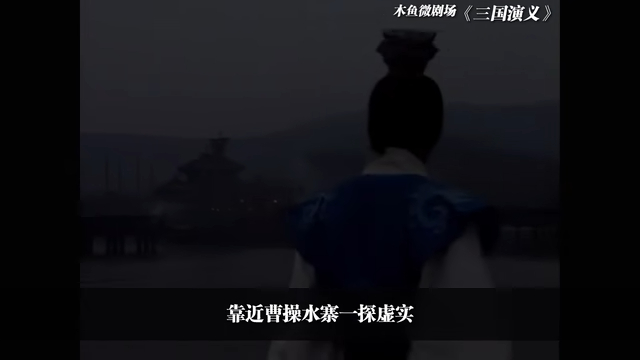
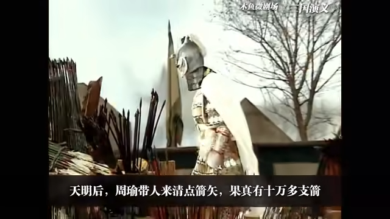
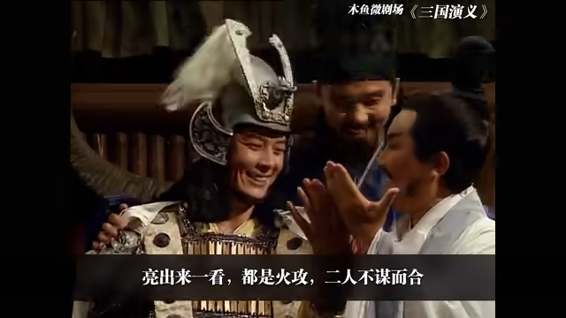
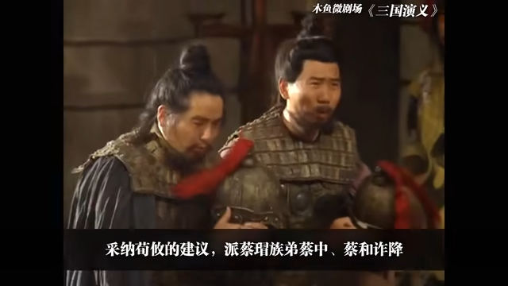
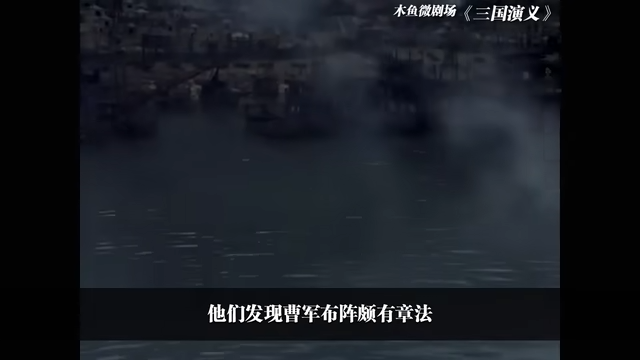

# 5-赤壁之战

<iframe sandbox="allow-top-navigation-by-user-activation allow-same-origin allow-forms allow-scripts allow-popups" src="https://player.bilibili.com/player.html?bvid=BV1hx411e7KP&amp;page=5&amp;high_quality=1&amp;as_wide=1&amp;allowfullscreen=true&amp;autoplay=0&amp;t=0" data-src="" border="0" frameborder="no" framespacing="0" allowfullscreen="true" style="height: 513px; width: 903px; pointer-events: none;"></iframe>

#### 视频笔记

> 作者：#视频笔记/木鱼水心#​
>
> 时长：15:15
>
> 状态：#视频笔记/木鱼水心/未读#​

[[04:32]](##)

> asdasda sdas d

​​

[[07:20]](##)

> asdasdasdasdasd

​​

[[07:29]](##)

> asdasdasdasdas

​​

[[07:36]](##)

> asdasdasdasdasd

​​

[[04:34]](##)

> asdasdasdasdwqdqw

​​

‍
