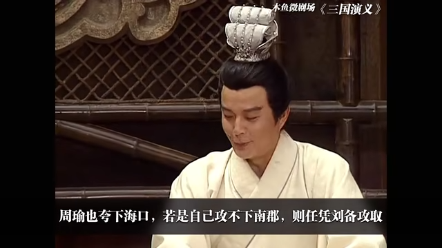
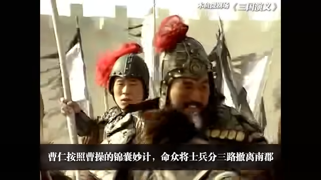
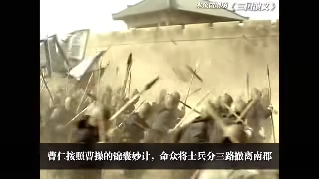
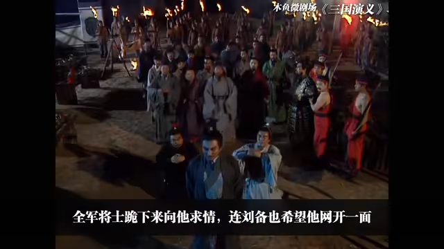
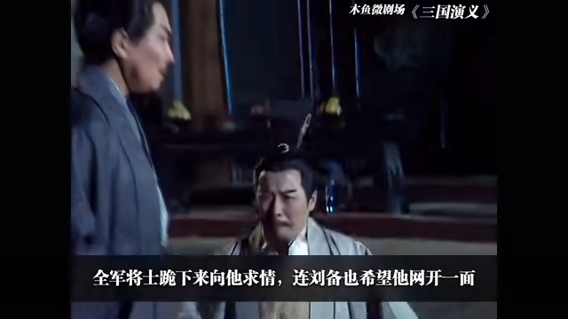
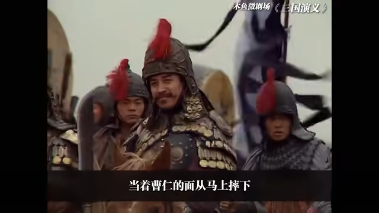
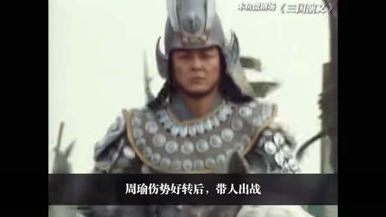

# 6-三气周瑜

<iframe sandbox="allow-top-navigation-by-user-activation allow-same-origin allow-forms allow-scripts allow-popups" src="https://player.bilibili.com/player.html?bvid=BV1hx411e7KP&amp;page=6&amp;high_quality=1&amp;as_wide=1&amp;allowfullscreen=true&amp;autoplay=0&amp;t=0" data-src="" border="0" frameborder="no" framespacing="0" allowfullscreen="true" style="height: 513px; width: 903px; pointer-events: none;"></iframe>

#### 视频笔记

> 作者：#视频笔记/木鱼水心#​
>
> 时长：11:36
>
> 状态：#视频笔记/木鱼水心/未读#​

#### [&lt;]()​[[00:00]](##)​[&gt;]()：

> ‍

#### [&lt;]()​[[00:00]](##)​[&gt;]()：

> ‍

#### [&lt;]()​[[00:15]](##)​[&gt;]()：

> ‍

#### [&lt;]()​[[00:17]](##)​[&gt;]()：

> ‍

#### [&lt;]()​[[00:19]](##)​[&gt;]()：

> ‍

#### [&lt;]()​[[00:49]](##)​[&gt;]()：

> ‍

#### [&lt;]()​[[00:50]](##)​[&gt;]()：

> ‍

#### [[00:52]](##)：

> ‍

> ​​

#### [&lt;]()​[[00:55]](##)​[&gt;]()：

> ‍

#### [&lt;]()​[[00:57]](##)​[&gt;]()：

> ‍

#### [&lt;]()​[[00:58]](##)​[&gt;]()：

> ‍

#### [&lt;]()​[[01:00]](##)​[&gt;]()：

> ‍

#### [&lt;]( "before")​[[00:50]](##)​[&gt;]( "next")：

> ‍

#### [&lt;]( "before")​[[00:53]](##)​[&gt;]( "next")：

> ‍

#### [&lt;]( "before")​[[00:57]](##)​[&gt;]( "next")：

> ‍

> ​​

#### [&lt;]( "before")​[[01:01]](##)​[&gt;]( "next")：

> ‍

> ​​

#### [[00:00]](##)：

> ‍

#### [[00:01]](##)：

> ‍

#### [[00:03]](##)：

> ‍

#### [[00:04]](##)：

>  [[00:07]](##)  [[00:08]](##)  [[00:10]](##)
>
>  ​​

#### [[00:13]](##)：

>  [[00:17]](##)  [[00:18]](##)  [[00:19]](##)  [[00:19]](##)  [[00:20]](##)

> ​​

#### [[00:22]](##)：

> 啊大大- 拒收到付克里斯丁f [[00:56]](##) [[01:26]](##) [[01:31]](##)
>
>  ​​
>
> * 时代峰峻离开时代峰峻拉卡萨代发 [[00:59]](##)
> * sdflksdjlfjsd‘ [[01:03]](##) [[01:21]](##)
>
>    ​​
> * sjdfsdjklfjsjfskdjf [[01:06]](##)
> * 分手快乐东方巨龙开始d [[01:08]](##)
> * 封建时代开了房就开了sdf [[01:11]](##)
> * 说的发离开家克里斯丁fsd [[01:13]](##)
> * 见风使舵开了房就开了说的f’ [[01:16]](##)

‍
