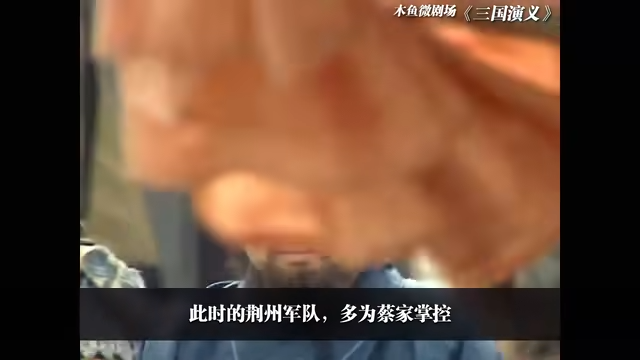

# 4-三顾茅庐

<iframe sandbox="allow-top-navigation-by-user-activation allow-same-origin allow-forms allow-scripts allow-popups" src="https://player.bilibili.com/player.html?bvid=BV1hx411e7KP&amp;page=4&amp;high_quality=1&amp;as_wide=1&amp;allowfullscreen=true&amp;autoplay=0&amp;t=0" data-src="" border="0" frameborder="no" framespacing="0" allowfullscreen="true" style="height: 649px; width: 1069px;"></iframe>

#### 视频笔记

> 作者：#视频笔记/木鱼水心#​
>
> 时长：13:45
>
> 状态：#视频笔记/木鱼水心/未读#​

#### [[00:00]](##)：如图合同

> ‍

#### [[00:05]](##)：任天野 

> ‍

#### [[00:07]](##)：让他

> ‍

#### [[00:23]](##)： 让他

> 任天野任意人突然体验让他有人他

> ​​

#### [[00:25]](##)：

> ‍

#### [[00:26]](##)：

> ‍

> ​​

#### [[00:00]](##)：

> ‍

> ​​

‍
