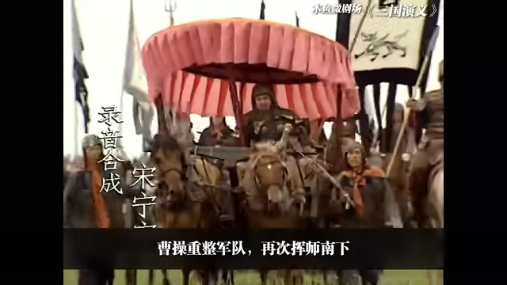
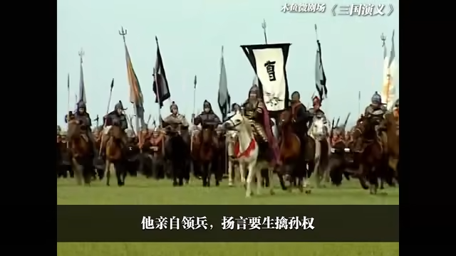

# 8-三足鼎立

<iframe sandbox="allow-top-navigation-by-user-activation allow-same-origin allow-forms allow-scripts allow-popups" src="https://player.bilibili.com/player.html?bvid=BV1hx411e7KP&amp;page=8&amp;high_quality=1&amp;as_wide=1&amp;allowfullscreen=true&amp;autoplay=0&amp;t=0" data-src="" border="0" frameborder="no" framespacing="0" allowfullscreen="true" style="height: 513px; width: 903px; pointer-events: none;"></iframe>

#### 视频笔记

> 作者：#视频笔记/木鱼水心#​
>
> 时长：17:46
>
> 状态：#视频笔记/木鱼水心/未读#​

#### [&lt;]( "before")​[[00:00]](##)​[&gt;]( "next")：

>  [[00:00]](##)  [[00:00]](##)  [[00:02]](##)  [[00:03]](##)  [[00:04]](##)  [[00:06]](##)  [[00:09]](##)  [[00:11]](##)
>
>  ​​

#### [&lt;]( "before")​[[00:02]](##)​[&gt;]( "next")：

>  [[00:19]](##)  [[00:20]](##)  [[00:21]](##)  [[00:25]](##)  [[00:26]](##)

#### [&lt;]( "before")​[[00:04]](##)​[&gt;]( "next")：

>  [[00:07]](##)  [[00:08]](##)  [[00:09]](##)  [[00:10]](##)  [[00:10]](##)

#### [&lt;]( "before")​[[00:07]](##)​[&gt;]( "next")：

>  [[00:13]](##)  [[00:14]](##)  [[00:15]](##)  [[00:15]](##)  [[00:15]](##)  [[00:16]](##)

> ​​

#### [&lt;]( "before")​[[00:11]](##)​[&gt;]( "next")：

> 123 [[00:37]](##)
>
> * sdflsdfjlksd [[00:25]](##)
> * -sdfldsfljksdlkf [[00:21]](##)
>
>          -  sdfjsdlflsdkf [[00:28]](##)  [[00:30]](##)  [[00:34]](##)
>
> * sdfsldkfjdlsf [[00:40]](##)

#### [[00:27]](##)：

>  [[00:43]](##)  [[00:44]](##)  [[00:44]](##)  [[00:45]](##)  [[00:45]](##)  [[00:46]](##)  [[00:46]](##)  [[00:47]](##)  [[00:47]](##)  [[00:47]](##)  [[00:48]](##)  [[00:48]](##)  [[00:48]](##)

#### [[00:33]](##)：

>  [[00:40]](##)  [[00:41]](##)  [[00:41]](##)  [[00:42]](##)  [[00:43]](##)  [[00:43]](##)  [[00:44]](##)  [[00:44]](##)  [[00:45]](##)

> ​​

#### [[00:46]](##)：

>  [[00:50]](##)  [[00:51]](##)  [[00:52]](##)  [[00:52]](##)  [[00:52]](##)  [[00:53]](##)  [[00:53]](##)

#### [[00:55]](##)：

>  [[00:54]](##)

#### [[00:00]](##)：

>  [[00:56]](##)  [[00:57]](##)

#### [[00:02]](##)：

>  [[00:53]](##)  [[00:54]](##)  [[00:55]](##)  [[00:55]](##)  [[00:56]](##)

#### [[00:03]](##)：

>  [[00:46]](##)  [[00:47]](##)  [[00:48]](##)  [[00:49]](##)  [[00:49]](##)

#### [[00:04]](##)：

>  [[00:13]](##)  [[00:13]](##)  [[00:14]](##)  [[00:16]](##)  [[00:21]](##)  [[00:26]](##)  [[00:27]](##)

#### [[00:07]](##)：

>  [[01:06]](##)  [[01:06]](##)  [[01:07]](##)  [[01:07]](##)

#### [[00:08]](##)：

>  [[00:46]](##)  [[00:47]](##)  [[00:47]](##)  [[00:48]](##)  [[00:49]](##) [[00:36]](##)  [[00:37]](##)  [[00:38]](##)  [[00:42]](##)

#### [[00:09]](##)：

>  [[00:35]](##)  [[00:36]](##)  [[00:37]](##)  [[00:38]](##)  [[00:38]](##)  [[00:40]](##)  [[00:42]](##) [[01:13]](##)  [[01:14]](##)  [[01:14]](##)  [[01:14]](##)  [[01:15]](##)  [[01:20]](##)  [[01:24]](##)  [[01:25]](##)

#### [[01:18]](##)：

>  [[01:28]](##)  [[01:28]](##)  [[01:29]](##)  [[01:29]](##)  [[01:30]](##)  [[01:30]](##)  [[01:31]](##)  [[01:31]](##)  [[01:31]](##)  [[01:32]](##)  [[01:32]](##)  [[01:33]](##)  [[01:33]](##)  [[01:34]](##)  [[01:34]](##)  [[01:34]](##)  [[01:35]](##)  [[01:36]](##)  [[01:36]](##)  [[01:36]](##)  [[01:37]](##)

#### [[01:38]](##)：

>  [[01:44]](##)  [[01:46]](##) [[01:51]](##)  [[01:53]](##)  [[01:54]](##)  [[01:54]](##)
>
>  ​​

> ​​

#### [[01:55]](##)：

>  [[02:00]](##)  [[02:01]](##)  [[02:01]](##)  [[02:01]](##)  [[02:02]](##)  [[02:02]](##)  [[02:02]](##)

#### [[02:04]](##)：

>  [[02:07]](##)  [[02:08]](##)  [[02:08]](##)  [[02:09]](##)  [[02:09]](##)

> ​​

‍
