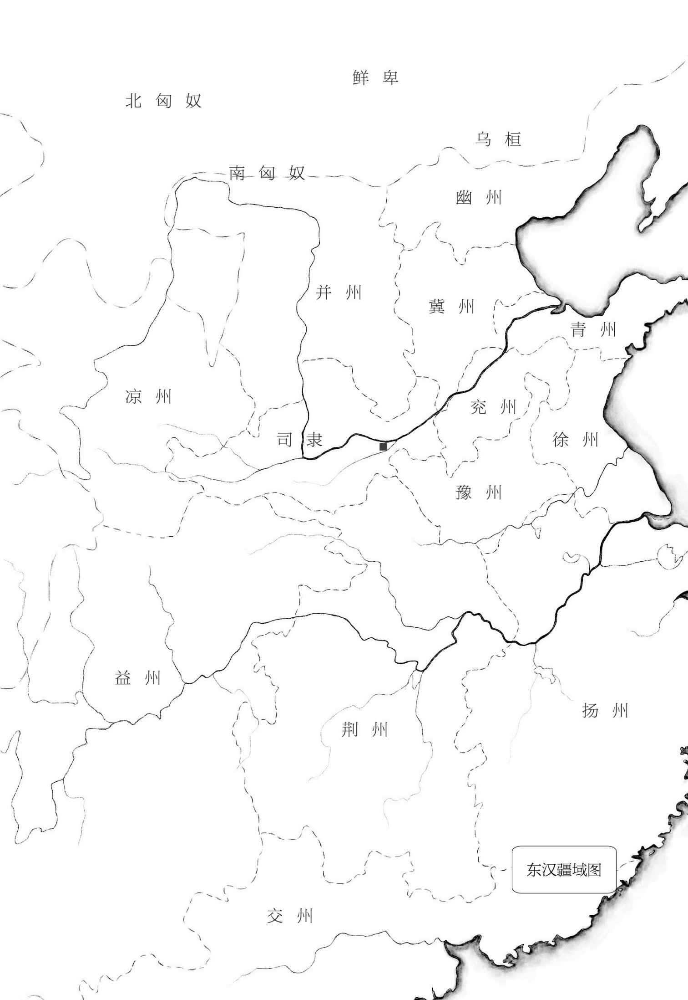

# [00000]版本说明

# 版本说明[  *  ](siyuan://blocks/20241123143349-hs7kliy?focus=1)

《三国演义》可能成书于元末明初，早期书名多为《三国志通俗演义》《三国志演义》等，经后人数次整理修改，至清初毛纶、毛宗岗父子进行大规模修订和精琢，语言更加流畅生动，并重新批注，使之成为流行三百多年的通行本（俗称毛本）。[  *  ](siyuan://blocks/20241123143349-9084val?focus=1)

本版正文以毛本为底本，辅以明代嘉靖本及几个有代表性的当代校本综合勘校，书中所涉及的人名、地名、年号、人物关系、官爵等，文学虚构外的部分讹误处按《三国志》等可靠史料予以更正，毛本中不合理的情节设置以及对关键人物的脸谱化处理，部分恢复嘉靖本等早期版本上更接近作者原笔的文字。[  *  ](siyuan://blocks/20241123143349-p14vas4?focus=1)

本版插图所涉及的地域图、形势图等均据权威地图资料严谨绘制，符合三国时代的基本地理概况，文中所虚构的地名、地点、战场等不再标注，因文学虚构而违反地理常识的部分描写也请读者自行甄别。[  *  ](siyuan://blocks/20241123143349-dz2ufbe?focus=1)

本版另精选毛批作为本书注释系统之一，为广大读者对这一伟大名著的深度理解作有益补充。[  *  ](siyuan://blocks/20241123143349-fhc00n9?focus=1)

（编校详情请参阅《后记》）[  *  ](siyuan://blocks/20241123143349-6yzsixo?focus=1)

​[  *  ](siyuan://blocks/20241123143349-b2zcs12?focus=1)

词曰：[  *  ](siyuan://blocks/20241123143349-vketjph?focus=1)

> 滚滚长江东逝水 浪花淘尽英雄
>
> 是非成败转头空
>
> 青山依旧在 几度夕阳红
>
> 白发渔樵江渚上 惯看秋月春风
>
> 一壶浊酒喜相逢
>
> 古今多少事 都付笑谈中

此“卷首词”为明代杨慎作，词牌为《临江仙》。原为《廿一史弹词·说秦汉》中的开场词。[  *  ](siyuan://blocks/20241123143349-oi2t1nb?focus=1)

‍

---

📜

⬅

➡

⬇

📚📖

⚡

🚫

✂📜

✂✅

✂📌
