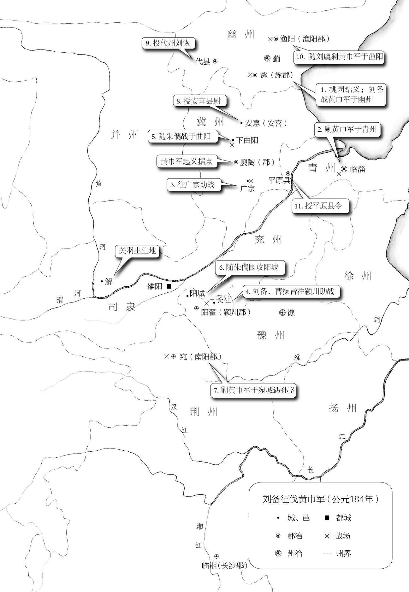

# [00001]第一回宴桃园豪杰三结义斩黄

# 第一回 宴桃园豪杰三结义 斩黄巾英雄首立功[  *  ](siyuan://blocks/20241123143349-w7ntbm8?focus=1)

话说天下大势，分久必合，合久必分。周末七国分争，并入于秦；及秦灭之后，楚汉分争，又并入于汉；汉朝自高祖斩白蛇自此愈横。[  *  ](siyuan://blocks/20241123143349-vb2rjjq?focus=1)

建宁二年四月望日山岸尽皆崩裂。种种不祥，非止一端。^(〚4〛)[  *  ](siyuan://blocks/20241123143349-7g1zvjw?focus=1)

帝下诏，问群臣以灾异之由。议郎蔡邕（读如拥）上疏，以为蜺堕之所致，言颇切直。帝览奏叹息，因起更衣。曹节在后窃视，悉宣告左右，遂以他事陷邕于罪，放归田里。后张让、赵忠、封谞（读如须）、段珪（读如归）、曹节、侯览、蹇（读如简）硕、程旷、夏恽（读如运）、郭胜十人，朋比为奸，号为“十常侍”。帝尊信张让，呼为“阿父”。朝政日非，以致天下人心思乱，盗贼蜂起。[  *  ](siyuan://blocks/20241123143349-x4x00tf?focus=1)

时巨鹿郡有兄弟三人，(〚5〛)一名张角，一名张宝，一名张梁。那张角本是个不第秀才，因入山采药，遇一老人，碧眼童颜，手执藜杖，唤角至一洞中，以天书三卷授之，曰：“此名《太平要术》，汝得之，当代天宣化，普救世人。若萌异心，必获恶报。”(〚6〛)角拜问姓名。老人曰：“吾乃南华老仙金帛，结交中涓封谞，以为内应。角与二弟商议曰：“至难得者，民心也。今民心已顺，若不乘势取天下，诚为可惜。”遂一面私造黄旗，约期举事，一面使弟子唐周驰书报封谞，唐州乃径赴省中告变。^(〚8〛)帝召大将军何进调兵擒马元义，斩之。次收封谞等一干人下狱。[  *  ](siyuan://blocks/20241123143349-65577o7?focus=1)

张角闻知事露，星夜举兵，自称“天公将军”，张宝称“地公将军”，张梁称“人公将军”，申言于众曰：“今汉运将终，大圣人出。汝等皆宜顺天从正，以乐太平。”四方百姓裹黄巾从张角反者四五十万。逢州遇县放火劫人，所在官吏望风逃窜。何进奏帝火速降诏，令各处备御，讨贼立功，一面遣中郎将卢植、皇甫嵩、朱隽（读如俊）各引精兵分三路讨之。[  *  ](siyuan://blocks/20241123143349-yx8v60s?focus=1)

且说张角一军前犯幽州界分。幽州刺史刘焉，乃江夏竟陵人氏，汉鲁恭王之后也。(〚9〛)当时闻得贼兵将至，召校尉邹靖计议。靖曰：“贼兵众，我兵寡，明公宜作速招军应敌。”刘焉然其说，随即出榜招募义兵。榜文行到涿县，引出涿县中一个英雄。那人不甚好读书，喜犬马，爱音乐，美衣服。少言语，礼下于人，喜怒不形于色。素有大志，专好结交天下豪杰。身长七尺五寸见玄德家贫，常资给之。元起妻曰：“各自一家，何能常耳。”元起曰：“吾宗中有此儿，非常人也！”(〚11〛)[  *  ](siyuan://blocks/20241123143349-g5msyw1?focus=1)

及刘焉发榜招军时，玄德年已二十八岁矣。当日见了榜文，慨然长叹。随后一人厉声言曰：“大丈夫不与国家出力，何故长叹？”玄德回视其人，身长八尺，豹头环眼，燕颔！”誓毕，拜玄德为兄，关羽次之，张飞为弟。祭罢天地，复宰牛设酒，聚乡中勇士，得三百余人，就桃园中痛饮一醉。[  *  ](siyuan://blocks/20241123143349-xdpknjx?focus=1)

来日收拾军器，但恨无马匹可乘。正思虑间，人报有两个客人引一伙伴当，赶一群马投庄上来。玄德曰：“此天佑我也。”三人出庄迎接。原来二客乃中山大商，一名张世平，一名苏双，每年往北贩马，近因寇发而回。玄德请二人到庄，置酒管待，诉说欲讨贼安民之意。二客大喜，愿将良马五十匹相送，又赠金银五百两、镔铁一千斤以资器用。玄德谢别二客，便命良匠打造双股剑；云长造青龙偃月刀，又名冷艳锯，重八十二斤；张飞造丈八点钢矛。各置全身铠甲。共聚乡勇五百余人，来见邹靖。邹靖引见太守刘焉。三人参见毕，各通姓名。玄德说起宗派，刘焉大喜，遂认玄德为侄。[  *  ](siyuan://blocks/20241123143349-l0mx3w8?focus=1)

不数日，人报黄巾贼将程远志统兵五万来犯涿郡。刘焉令邹靖引刘玄德为先锋，前去破敌。玄德部领五百余众，飞奔前来，直至大兴山下，与贼相见。贼众皆披发，以黄巾抹额。当下两军相对，玄德出马，左有云长，右有益德，扬鞭大骂：“反国逆贼，何不早降？”程远志大怒，遣副将邓茂出战。张飞挺丈八蛇矛直出，手起处，刺中邓茂心窝，翻身落马。程远志见折了邓茂，拍马舞刀，直取张飞。云长舞动大刀，纵马飞迎。程远志见了，早吃一惊，措手不及，被云长刀起处挥为两段。后人有诗赞二人曰：[  *  ](siyuan://blocks/20241123143349-uwhzork?focus=1)

> 英雄露颖在今朝，一试矛兮一试刀。
>
> 初出便将威力展，三分好把姓名标。

众贼见程远志被斩，皆倒戈而走。玄德挥军追赶，投降者不计其数，大胜而回。刘焉亲自迎接，赏劳军士。[  *  ](siyuan://blocks/20241123143349-ifzln6f?focus=1)

次日，接得青州刺史龚景牒文，张飞引一千军伏山右，鸣金为号，齐出接应。^(〚15〛)[  *  ](siyuan://blocks/20241123143349-lnwmw54?focus=1)

次日，玄德与邹靖引军鼓噪而进。贼众迎战，玄德引军便退。贼众乘势追赶。方过山岭，玄德军中一齐鸣金，左右两军齐出，玄德麾军回身复杀。三路夹攻，贼众大溃，直赶至青州城下。太守龚景亦率民兵出城助战。贼势大败，剿戮极多，遂解青州之围。后人有诗赞玄德曰：[  *  ](siyuan://blocks/20241123143349-dv6m2mt?focus=1)

> 运筹决算有神功，二虎还须逊一龙。
>
> 初出便能垂伟绩，自应分鼎在孤穷。

龚景犒军毕，邹靖欲回。玄德曰：“近闻中郎将卢植与贼首张角战于广宗，备昔曾师事卢植，欲往助之。”于是邹靖引军自回，玄德与关、张引本部五百人投广宗来。至卢植军中，入帐施礼，具道来意。卢植大喜，留在帐前听调。[  *  ](siyuan://blocks/20241123143349-bf0q4m0?focus=1)

时张角贼众十五万，植兵五万，相拒于广宗，未见胜负。植谓玄德曰：“我今围贼在此，贼弟张梁、张宝，在颍川与皇甫嵩、朱隽对垒。汝可引本部人马，我更助汝一千官军，前去颍川打探消息，约期剿捕。”玄德领命，引军星夜投颍川来。^(〚16〛)时皇甫嵩、朱隽领军拒贼，贼战不利，退入长社，依草结营。嵩与隽计曰：“贼依草结营，当用火攻之。”遂令军士，每人束草一把，暗地埋伏。其夜大风忽起，二更以后，一齐纵火，嵩与隽各引兵攻击贼寨，火焰张天。贼众惊慌，马不及鞍，人不及甲，四散奔走。[  *  ](siyuan://blocks/20241123143349-khrhbs1?focus=1)

杀到天明，张梁、张宝引败残军士，夺路而走。忽见一彪军马，尽打红旗，当头来到，截住去路。^(〚17〛)为首闪出一个好英雄，身长七尺，细眼长髯，胆量过人，机谋出众，笑齐桓、晋文，后封费亭侯。养子曹嵩，原是夏侯氏子，过房与曹腾为子，因此姓曹。嵩为人忠孝纯雅，官拜司隶校尉，灵帝拜为大司农，迁大鸿胪。[  *  ](siyuan://blocks/20241123143349-zx8v0vl?focus=1)

曹嵩生操，小字阿瞒，一名吉利。操幼时好游猎，喜歌舞，有权谋，多机变。操有叔父，见操游荡无度，尝怒之，言于曹嵩。嵩每鞭挞令。^(〚20〛)因黄巾起，拜为骑都尉，引马步军五千，前来颍川助战。[  *  ](siyuan://blocks/20241123143349-m09uzy5?focus=1)

正值张梁、张宝败走，曹操拦住，大杀一阵，斩首万余级，夺得旗旙、金鼓、马匹极多。张梁、张宝死战得脱。操见过皇甫嵩、朱隽，随即引兵追袭张梁、张宝去了。^(〚21〛)[  *  ](siyuan://blocks/20241123143349-5jwcxdw?focus=1)

却说玄德引关、张来颍川，听得喊杀之声，又望见火光烛天，急引兵来时，贼已败散。玄德见皇甫嵩、朱隽，具道卢植之意。嵩曰：“张梁、张宝势穷力乏，必投广宗去依张角。玄德可即星夜往助。”玄德领命，遂引兵复回。(〚22〛)到得半路，只见一簇军马护送一辆槛车，车中之囚乃卢植也。玄德大惊，滚鞍下马，问其缘故。植曰：“我围张角，将次可破。因角用妖术，未能即胜。(〚23〛)朝廷差黄门左丰前来体探，问我索取贿赂。我答曰：‘军粮尚缺，安有余钱奉承天使？’左丰挟恨，回奏朝廷，说我高垒不战，惰慢军心。因此朝廷震怒，遣中郎将董卓来代将我兵，^(〚24〛)取我回京问罪。”张飞听罢大怒，要斩护送军人，以救卢植。玄德急止之，曰：“朝廷自有公论，汝岂可造次！”军士簇拥卢植去了。[  *  ](siyuan://blocks/20241123143349-rchsm06?focus=1)

关公曰：“卢中郎已被罢了军权，别人领兵，我等去无所依，不如且回涿郡。”玄德从其言，遂引军北行。行无二日，忽闻山后喊声大震，玄德引关、张纵马上高冈望之，见汉军大败，后面漫山塞野，黄巾盖地而来，旗上大书“天公将军”。玄德曰：“此张角也，可速战。”(〚25〛)三人飞马引军而出。张角正杀败董卓，乘势赶来，忽遇三人冲杀，角军大乱，败走五十余里。三人救了董卓回寨。(〚26〛〚27〛)卓问三人现居何职，玄德曰：“白身。”卓甚轻之，不与赏赐。玄德出，张飞大怒曰：“我等亲赴血战，救了这厮，到觑人如无物，若不杀之，难消我气！”便要提刀入帐，来杀董卓。^(〚28〛)正是：[  *  ](siyuan://blocks/20241123143349-td8jbqr?focus=1)

> 人情势利古犹今，谁识英雄是白身？
>
> 安得快人如益德，尽诛世上负心人。

毕竟董卓性命如何，且听下文分解。[  *  ](siyuan://blocks/20241123143349-d1pplr7?focus=1)

〚1〛《出师表》曰：“叹息痛恨于桓、灵。”故从桓、灵说起。桓、灵不用十常侍，则东汉可以不为三国；刘禅不用黄皓，则蜀汉可以不为晋国。此一部大书前后照应处。[  *  ](siyuan://blocks/20241123143349-crubh6d?focus=1)

〚2〛白蛇斩而汉兴，青蛇见而汉危。青蛇、白蛇，遥遥相对。[  *  ](siyuan://blocks/20241123143349-2vxm7oj?focus=1)

〚3〛此兆尤切中宦官。以男子而净身，则雄化为雌矣；以阉人而干政，则雌又化为雄矣。[  *  ](siyuan://blocks/20241123143349-lajp9c5?focus=1)

〚4〛先说灾异，引起盗贼。[  *  ](siyuan://blocks/20241123143349-gprq8xu?focus=1)

〚5〛以此兄弟三人，引出桃园兄弟三人来。[  *  ](siyuan://blocks/20241123143349-l52x8qi?focus=1)

〚6〛若无此句，人不肯信。[  *  ](siyuan://blocks/20241123143349-6fznylt?focus=1)

〚7〛此事谁见来？是张角自言之，而人遂信之，正与篝火狐鸣一般伎俩。[  *  ](siyuan://blocks/20241123143349-o14h6c3?focus=1)

〚8〛中涓反作奸细，奸细反作首人，可见内寇更恶于外寇。[  *  ](siyuan://blocks/20241123143349-xqrptvs?focus=1)

〚9〛鲁恭王之后，引出中山靖王之后来。[  *  ](siyuan://blocks/20241123143349-m6haifq?focus=1)

〚10〛汉高微时，见始皇车从，曰：“丈夫不当如是耶？”正与此合。[  *  ](siyuan://blocks/20241123143349-j9rznre?focus=1)

〚11〛以上是玄德一篇小传。[  *  ](siyuan://blocks/20241123143349-tmyojb6?focus=1)

〚12〛毕竟有赀财者易于举大事。[  *  ](siyuan://blocks/20241123143349-pbcvnzw?focus=1)

〚13〛写玄德先遇张公，次遇关公，叙法参差有致。[  *  ](siyuan://blocks/20241123143349-6ucdrda?focus=1)

〚14〛前以五百而大胜，此以五千而小却，写得变幻。若每战必写获捷，便不成文字矣。[  *  ](siyuan://blocks/20241123143349-zkustxx?focus=1)

〚15〛先写关、张斩将，次写玄德运筹，叙法亦参差有致。[  *  ](siyuan://blocks/20241123143349-a2830rm?focus=1)

〚16〛本要助卢植，却使转助皇甫嵩、朱隽，叙法变幻。[  *  ](siyuan://blocks/20241123143349-pb2vvfp?focus=1)

〚17〛读至此，必谓是玄德、关、张来矣，不意竟不是。奇绝。[  *  ](siyuan://blocks/20241123143349-jaklrr3?focus=1)

〚18〛二人皆不识曹操，曹操闻之亦不喜。[  *  ](siyuan://blocks/20241123143349-cb0knxp?focus=1)

〚19〛称之为奸雄而大喜，大喜便是真正奸雄。[  *  ](siyuan://blocks/20241123143349-ci6umbh?focus=1)

〚20〛百忙中夹叙曹操一篇小传，奇。[  *  ](siyuan://blocks/20241123143349-oeipquv?focus=1)

〚21〛写曹操忽然飞来，忽然飞去，奇绝。[  *  ](siyuan://blocks/20241123143349-g7wiytk?focus=1)

〚22〛卢植遣助皇甫嵩、朱隽，皇甫嵩、朱隽又遣助卢植，叙法变幻。[  *  ](siyuan://blocks/20241123143349-w8ddpdx?focus=1)

〚23〛张角妖术，在卢植口中虚叙一句，好。[  *  ](siyuan://blocks/20241123143349-0z5hepz?focus=1)

〚24〛先伏一笔。[  *  ](siyuan://blocks/20241123143349-9t02di8?focus=1)

〚25〛玄德两番往来，本要助战，却都未战。今引兵欲回，本不想战，却反得一战。叙法俱变。[  *  ](siyuan://blocks/20241123143349-z2mrm14?focus=1)

〚26〛本要助卢植，却反救了董卓，变幻。[  *  ](siyuan://blocks/20241123143349-ejtpd6e?focus=1)

〚27〛此回本叙刘、关、张，中间却夹叙曹操，末后又带出董卓，奇绝。[  *  ](siyuan://blocks/20241123143349-vrc1itw?focus=1)

〚28〛见卢植受屈便要救，见董卓无礼便要杀，略无一毫算计。写益德真是当时第一快人。[  *  ](siyuan://blocks/20241123143349-l7j6xb6?focus=1)

​[  *  ](siyuan://blocks/20241123143349-vpkdbhj?focus=1)

‍

---

📜

⬅

➡

⬇

📚📖

⚡

🚫

✂📜

✂✅

✂📌
