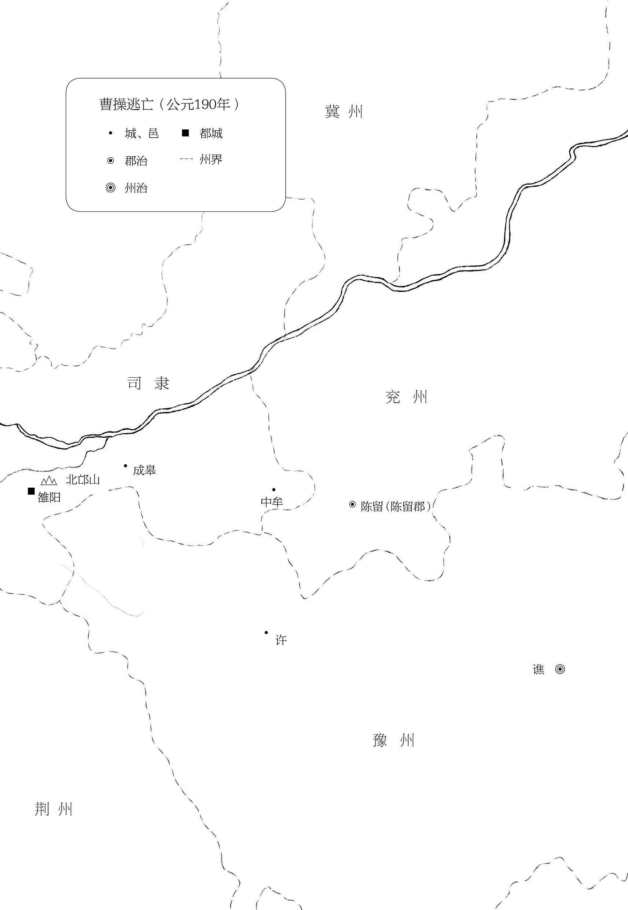

# [00004]第四回废汉帝陈留践位谋董贼

# 第四回 废汉帝陈留践位 谋董贼孟德献刀[  *  ](siyuan://blocks/20241123143349-s8tf4mz?focus=1)

且说董卓欲杀袁绍，李儒止之曰：“事未可定，不可妄杀。”袁绍手提宝剑，辞别百官而出，悬节东门之急，势必为变。且袁氏树恩四世，门生故吏遍于天下，倘收豪杰以聚徒众，英雄因之而起，山东非公有也。不如赦之，拜为一郡守，则绍喜于免罪，必无患矣。”伍琼曰：“袁绍好谋无断，^(〚79〛)不足为虑。诚不若加之一郡守，以收民心。”卓从之，即日差人拜绍为渤海太守。[  *  ](siyuan://blocks/20241123143349-x9eddd7?focus=1)

九月朔，请帝升嘉德殿，大会文武。卓拔剑在手对众曰：“天子暗弱，不足以君天下。今有策文一道，宜为宣读。”乃命李儒读策曰：[  *  ](siyuan://blocks/20241123143349-mqh61j8?focus=1)

> 孝灵皇帝，早弃臣民；皇帝承嗣，海内侧望。而帝天资轻佻，威仪不恪美誉，天下所闻：宜承洪业，为万世统。兹废皇帝为弘农王，皇太后还政。请奉陈留王为皇帝，应天顺人，以慰生灵之望。

李儒读策毕，卓叱。帝后皆号哭，群臣无不悲惨。阶下一大臣，愤怒高叫曰：“贼臣董卓，敢为欺天之谋，吾当以颈血溅之！”挥手中象简，直击董卓。卓大怒，喝武士拿下：乃尚书丁管也。卓命牵出斩之。管骂不绝口，至死神色不变。后人有诗叹曰：[  *  ](siyuan://blocks/20241123143349-zjya83k?focus=1)

> 董贼潜怀废立图，汉家宗社委丘墟。
>
> 满朝臣宰皆囊括，惟有丁公是丈夫。

卓请陈留王登殿。群臣朝贺毕，卓命扶何太后并弘农王及帝妃唐氏于永安宫闲住。封锁宫门，禁群臣无得擅入。可怜少帝四月登基，至九月即被废。卓所立陈留王协，表字伯和，灵帝中子，即献帝也，时年九岁。改元初平。董卓为相国，赞拜不名用名流，以收人望，因荐蔡邕之才。卓命征之，邕不赴。卓怒，使人谓邕曰：“如不来，当灭汝族。”邕惧，只得应命而至。卓见邕大喜，一月三迁其官，拜为侍中，甚见亲厚。[  *  ](siyuan://blocks/20241123143349-wi2vo19?focus=1)

却说少帝与何太后、唐妃困于永安宫中，衣服饮食渐渐少缺。少帝泪不曾干。一日偶见双燕飞于庭中，遂吟诗一首。^(〚80〛)诗曰：[  *  ](siyuan://blocks/20241123143349-s1jnku3?focus=1)

> 嫩草绿凝烟，袅袅双飞燕。
>
> 洛水一条青，陌上人称羡。^(〚81〛)
>
> 远望碧云深，是吾旧宫殿。^(〚82〛)
>
> 何人仗忠义，泄我心中怨？^(〚83〛)

董卓时常使人探听，是日获得此诗，来呈董卓。卓曰：“怨望作诗，杀之有名矣。”遂命李儒带武士十人，入宫弑帝。帝与后、妃正在楼上，宫女报李儒至，帝大惊。儒以鸩酒奉帝。帝问何故，儒曰：“春日融和，^(〚84〛)董相国特上寿酒。”太后曰：“既云寿酒，汝可先饮。”儒怒曰：“汝不饮耶？”呼左右持短刀、白练于前，曰：“寿酒不饮，可领此二物！”唐妃跪告曰：“妾身代帝饮酒，愿公存母子性命。”儒叱曰：“汝何人，可代王死？”乃举酒与何太后曰：“汝可先饮。”后大骂：“何进无谋，引贼入京，致有今日之祸！”儒催逼帝，帝曰：“容我与太后作别。”乃大恸而作歌。其歌曰：[  *  ](siyuan://blocks/20241123143349-q8ipbo6?focus=1)

> 天地易兮日月翻，弃万乘兮退守藩。
>
> 为臣逼兮命不久，大势去兮空泪潸！

唐妃亦作歌曰：[  *  ](siyuan://blocks/20241123143349-pgq2hqw?focus=1)

> 皇天将崩兮后土颓，身为帝姬兮命不随。
>
> 生死异路兮从此毕，奈何茕速兮心中悲！

歌罢，相抱而哭。李儒叱曰：“相国立等回报，汝等俄延，望谁救耶？”太后大骂：“董贼逼我母子，皇天不佑！汝等助恶，必当灭族！”儒大怒，双手扯住太后，直撺下楼；叱武士绞死唐妃；以鸩酒灌杀少帝。还报董卓，卓命葬于城外。自此每夜入宫，奸淫宫女，夜宿龙床，禁庭公主，尽皆淫之。尝引军出城，行到阳城地方。时当二月，村民社赛还都，扬言杀贼大胜而回，于城门外焚烧人头，以妇女财物分散众军。[  *  ](siyuan://blocks/20241123143349-fzbsz5e?focus=1)

越骑校尉伍孚，字德瑜，见卓残暴，愤恨不平。尝于朝服内披小铠，藏短刀，欲伺便杀卓。一日，卓入朝，孚迎至阁下，拔刀直刺卓。^(〚85〛〚86〛)卓气力大，两手抠住；吕布便入，揪倒伍孚。卓问曰：“谁教汝反？”孚瞪目大喝曰：“汝非吾君，吾非汝臣，何反之有！汝罪恶盈天，人人愿得而诛之，吾恨不车裂汝以谢天下！”卓大怒，命牵出剖剐之。孚比死骂不绝口。后人有诗赞之曰：[  *  ](siyuan://blocks/20241123143349-ceifih7?focus=1)

> 汉末忠臣说伍孚，冲天豪气世间无。
>
> 朝堂杀贼名犹在，万古堪称大丈夫！

董卓自此出入常带甲士护卫。[  *  ](siyuan://blocks/20241123143349-0zjvj8u?focus=1)

时袁绍在渤海，闻知董卓弄权，乃差人赍密书来见王允。^(〚87〛〚88〛)书略曰：[  *  ](siyuan://blocks/20241123143349-1t71d6k?focus=1)

> 卓贼欺天废主，人不忍言；而公恣其跋扈，如不听闻，岂报国效忠之臣哉？绍今集兵练卒，欲扫清王室，未敢轻动。公若有心，当乘间图之。倘有驱使，即当奉命。

王允得书，寻思无计。一日，于侍班阁子内，见旧臣俱在，允曰：“今日老夫贱降。[  *  ](siyuan://blocks/20241123143349-seoegwy?focus=1)

次日，曹操佩着宝刀来至相府，问：“丞相何在？”从人云：“在小阁中。”操径入。见董卓坐于床上，吕布侍立于侧。卓曰：“孟德来何迟？”操曰：“马羸，乃持刀跪下曰：“操有宝刀一口，献上恩相。”(〚93〛〚94〛)卓接视之，见其刀长尺余，七宝嵌饰，极其锋利，果宝刀也。遂递与吕布收了。操解鞘付布。(〚95〛)卓引操出阁看马，操谢曰：“愿借试一骑。”卓就教与鞍辔。操牵马出相府，加鞭望东南而去。布对卓曰：“适来曹操似有行刺之状，及被喝破，故推献刀。”卓曰：“吾亦疑之。”^(〚96〛)[  *  ](siyuan://blocks/20241123143349-g7gwwgl?focus=1)

正说话间，适李儒至，卓以其事告之。儒曰：“操无妻小在京^(〚97〛)，只独居寓所。今差人往召，如彼无疑而便来，则是献刀；如推托不来，则必是行刺，便可擒而问也。”卓然其说，即差狱卒四人往唤操。(〚98〛)去了良久，回报曰：“操不曾回寓，乘马飞出东门。门吏问之，操曰：‘丞相差我有紧急公事。’纵马而去矣。”(〚99〛)儒曰：“操贼心虚逃窜，行刺无疑矣。”卓大怒曰：“我如此重用，反欲害我！”儒曰：“此必有同谋者，待拿住曹操，便可知矣。”卓遂令遍行文书，画影图形，捉拿曹操，擒献者赏千金、封万户侯，窝藏者同罪。[  *  ](siyuan://blocks/20241123143349-lqzjl6d?focus=1)

且说曹操逃出城外，飞奔谯郡。路经中牟县，为守关军士所获。擒见县令，操言：“我是客商，覆姓皇甫。”县令熟视曹操，沉吟半晌，乃曰：“吾前在洛阳求官时，曾认得汝是曹操，如何隐讳？且把来监下，明日解去京师请赏。”^(〚100〛)把关军士赐以酒食而去。[  *  ](siyuan://blocks/20241123143349-38j6nhq?focus=1)

至夜分，县令唤亲随人暗地取出曹操，直至后院中审究。(〚101〛)问曰：“我闻丞相待汝不薄，何故自取其祸？”操曰：“燕雀安知鸿鹄志哉！汝既拿住我，便当解去请赏，何必多问！”(〚102〛)县令屏退左右，谓操曰：“汝休小觑我。我非俗吏，奈未遇其主耳。”操曰：“吾祖宗世食汉禄，若不思报国，与禽兽何异？吾屈身事卓者，欲乘间图之，为国除害耳。今事不成，乃天意也！”县令曰：“孟德此行，将欲何往？”操曰：“吾将归乡里，发矫诏，召天下诸侯兴兵共诛董卓：吾之愿也。”县令闻言，乃亲释其缚，扶之上坐，再拜曰：“公真天下忠义之士也！”曹操亦拜问县令姓名。县令曰：“吾姓陈，名宫，字公台。(〚103〛)老母妻子，皆在东郡。(〚104〛)今感公忠义，愿弃一官，从公而逃。”操甚喜。是夜陈宫收拾盘费，与曹操更衣易服，各背剑一口，乘马投故乡来。[  *  ](siyuan://blocks/20241123143349-nhu9lzp?focus=1)

行了三日，至成皋一樽来相待。”言讫，匆匆上驴而去。[  *  ](siyuan://blocks/20241123143349-27v26ux?focus=1)

操与宫坐久，忽闻庄后有磨刀之声。操曰：“吕伯奢非吾至亲，(〚107〛)此去可疑，当窃听之。”二人潜步入草堂后，但闻人语曰：“缚而杀之，何如？”操曰：“是矣！今若不先下手，必遭擒获。”遂与宫拔剑直入，不问男女，皆杀之，一连杀死八口。搜至厨下，却见缚一猪欲杀。宫曰：“孟德心多，误杀好人矣！”急出庄，上马而行。行不到二里，只见伯奢驴鞍前鞒悬酒二瓶，手携果菜而来，叫曰：“贤侄与使君何故便去？”操曰：“被罪之人，不敢久住。”伯奢曰：“吾已分付家人宰一猪相款，(〚108〛)贤侄、使君何憎一宿？速请转骑。”操不顾，策马便行。行不数步，忽拔剑复回，叫伯奢曰：“此来者何人？”伯奢回头看时，操挥剑砍伯奢于驴下。宫大惊曰：“适才误耳，今何为也？”操曰：“伯奢到家，见杀死多人，安肯干休？若率众来追，必遭其祸矣。”(〚109〛)宫曰：“知而故杀，大不义也。”操曰：“宁教我负天下人，休教天下人负我。”(〚110〛)陈宫默然。[  *  ](siyuan://blocks/20241123143349-nvghz85?focus=1)

当夜行数里，月明中敲开客店门投宿。^(〚111〛〚112〛)喂饱了马，曹操先睡。陈宫寻思：“我将谓曹操是好人，弃官跟他，原来是个狼心之徒！今日留之，必为后患！”便欲拔剑来杀曹操。正是：[  *  ](siyuan://blocks/20241123143349-7cks6v3?focus=1)

> 设心狠毒非良士，操卓原来一路人。

毕竟曹操性命如何，且听下文分解。[  *  ](siyuan://blocks/20241123143349-ydhzeew?focus=1)

〚79〛四字评定。[  *  ](siyuan://blocks/20241123143349-w8djxh5?focus=1)

〚80〛空庭飞鸟，任其翔舞；冷宫废主，身被牢笼。触目感愤，抗声而吟，不知是诗，不知是泪？[  *  ](siyuan://blocks/20241123143349-6ur9fbu?focus=1)

〚81〛前半首咏燕，兴也，比也。[  *  ](siyuan://blocks/20241123143349-oh4irzv?focus=1)

〚82〛目断旧宫，不能奋飞，诚不如双燕之得反故巢矣。伤哉！[  *  ](siyuan://blocks/20241123143349-sfyhi7j?focus=1)

〚83〛后半首自咏，赋也。[  *  ](siyuan://blocks/20241123143349-555mgw2?focus=1)

〚84〛是双燕飞庭时节。[  *  ](siyuan://blocks/20241123143349-3k8mcwo?focus=1)

〚85〛将叙曹操行刺，却先有伍孚行刺作引。天然奇妙。[  *  ](siyuan://blocks/20241123143349-acn1y9f?focus=1)

〚86〛孚之勇往直前较胜于操，盖曹操顾身，伍孚不顾身也。[  *  ](siyuan://blocks/20241123143349-4i3tc1q?focus=1)

〚87〛夹写袁绍致书，前应悬节出奔，后伏兴兵会盟，妙甚。[  *  ](siyuan://blocks/20241123143349-dwbx6vp?focus=1)

〚88〛接叙出王允，尤妙。[  *  ](siyuan://blocks/20241123143349-ji0wvow?focus=1)

〚89〛袁绍致书，孟德献刀，一样愤激，而操更壮。[  *  ](siyuan://blocks/20241123143349-bmcu04e?focus=1)

〚90〛亏此一句，后来好逃走。[  *  ](siyuan://blocks/20241123143349-yf81k4a?focus=1)

〚91〛有鉴于伍孚之事也。[  *  ](siyuan://blocks/20241123143349-2051yaw?focus=1)

〚92〛读书者至此，大为曹操捏一身汗。[  *  ](siyuan://blocks/20241123143349-i4o39lc?focus=1)

〚93〛好权变，的是奸雄。[  *  ](siyuan://blocks/20241123143349-03flglq?focus=1)

〚94〛刺卓何必宝刀，其所以请宝刀者，预为地也。献刀之举，未必不在曹操算中。[  *  ](siyuan://blocks/20241123143349-hd6dtg9?focus=1)

〚95〛先拔刀，后解鞘，明明行刺。董卓愚莽，故不省得。[  *  ](siyuan://blocks/20241123143349-atswlws?focus=1)

〚96〛此是顺口话，适才并不曾疑。[  *  ](siyuan://blocks/20241123143349-b77tlw3?focus=1)

〚97〛唯其如此，所以去得放心，去得干净。此句在李儒口中带叙出来，省笔。[  *  ](siyuan://blocks/20241123143349-e23cxyx?focus=1)

〚98〛差狱卒便是擒捉之状。[  *  ](siyuan://blocks/20241123143349-wad6nnn?focus=1)

〚99〛此段在狱卒口中补叙出来，省笔。[  *  ](siyuan://blocks/20241123143349-7ccwtlc?focus=1)

〚100〛熟视沉吟后却说出此数语，孟德奈何？[  *  ](siyuan://blocks/20241123143349-5nr7gde?focus=1)

〚101〛精细。此熟视沉吟时算定者。[  *  ](siyuan://blocks/20241123143349-7p9l9qz?focus=1)

〚102〛此县令须以此言动之。奸雄眼力过人。[  *  ](siyuan://blocks/20241123143349-zzfq24i?focus=1)

〚103〛至此方出姓名，好。[  *  ](siyuan://blocks/20241123143349-acgag8m?focus=1)

〚104〛此处先说老母妻子，遥对后白门楼中语。[  *  ](siyuan://blocks/20241123143349-0c9d4va?focus=1)

〚105〛应上“家中消息”句。[  *  ](siyuan://blocks/20241123143349-g9zt67m?focus=1)

〚106〛写得举动可疑。[  *  ](siyuan://blocks/20241123143349-i3b3vso?focus=1)

〚107〛应上“结义弟兄”句。[  *  ](siyuan://blocks/20241123143349-wsa05j5?focus=1)

〚108〛适来入内良久，正为分付此耳。[  *  ](siyuan://blocks/20241123143349-02rne4v?focus=1)

〚109〛此等见识，在曹操原自不差。[  *  ](siyuan://blocks/20241123143349-z339pkz?focus=1)

〚110〛曹操从前竟似一个好人，到此忽然说出奸雄心事。此二语是开宗明义章第一。[  *  ](siyuan://blocks/20241123143349-7clhhsp?focus=1)

〚111〛又是一幅绝妙画景。[  *  ](siyuan://blocks/20241123143349-iuuloer?focus=1)

〚112〛忙中偏有此点缀，妙。[  *  ](siyuan://blocks/20241123143349-d0ldsg5?focus=1)

​[  *  ](siyuan://blocks/20241123143349-ab0pvjr?focus=1)

‍

---

📜

⬅

➡

⬇

📚📖

⚡

🚫

✂📜

✂✅

✂📌
