# 44-动画片三国演义 第44集 出师北伐 高清

<iframe sandbox="allow-top-navigation-by-user-activation allow-same-origin allow-forms allow-scripts allow-popups" src="https://www.youtube.com/embed/-TJtczs1McQ" data-src="" border="0" frameborder="no" framespacing="0" allowfullscreen="true" style="height: 513px; width: 903px; pointer-events: none;"></iframe>

#### 视频笔记

> 作者：#视频笔记/GalaxySpace YouTube#​
>
> 时长：25:01
>
> 状态：#视频笔记/GalaxySpace YouTube/未读#​

#### [[02:40]](## "https://www.youtube.com/embed/-TJtczs1McQ")：第一次北伐

> ‍

#### [[03:05]](## "https://www.youtube.com/embed/-TJtczs1McQ")：✅赵云请战

> ‍

> ​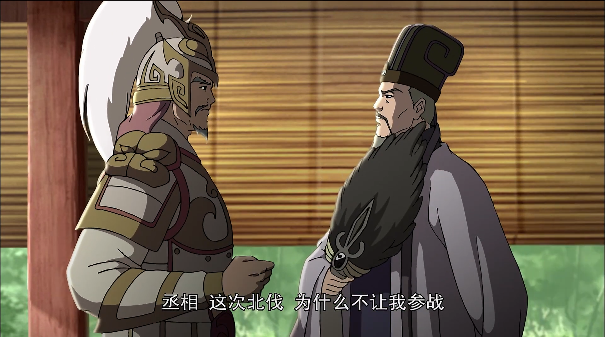​

#### [[04:12]](## "https://www.youtube.com/embed/-TJtczs1McQ")：第一次北伐

> ## 诸葛亮进行了几次北伐，每次对手情况以及最后的结果  #AI/问题#​
>
> 诸葛亮在他执政期间共进行了五次北伐，每次北伐的对手、过程和结果如下：
>
> ### 1. **第一次北伐（227年-228年）**
>
> **对手情况：**  曹魏由曹真、夏侯楙等将领统领，防御力量较为充足。
>
> **过程：**
>
> * 227年，诸葛亮开始准备北伐，从汉中出发，采取了“兵分三路”的策略，主力部队进攻陇右地区（今甘肃东部和陕西西部）。
> * 马谡在**街亭失守**，是这次北伐的关键败笔。由于马谡未能守住街亭，导致蜀军失去了战略要地，整个北伐计划被迫中止。
> * 诸葛亮随后亲自率军在祁山一带与魏军交战，但因失去街亭的防御支撑，不得不撤军。
>
> **结果：**  以失败告终，诸葛亮因此受到朝廷批评，他则主动上表自责，并对马谡进行了严厉的惩罚，最终斩杀马谡以示警戒。
>
> ### 2. **第二次北伐（228年-229年）**
>
> **对手情况：**  魏国由曹真、司马懿等将领指挥，魏国防线得到加强。
>
> **过程：**
>
> * 诸葛亮再度从汉中出发，直指魏国的陈仓（今陕西宝鸡东）。
> * 魏军守将郝昭**坚守陈仓**，诸葛亮的攻城器械未能迅速奏效，久攻不下，粮草也逐渐短缺。
> * 魏军援军即将到来，诸葛亮决定撤军以避免进一步的损失。
>
> **结果：**  诸葛亮无奈撤退，北伐再次失败。
>
> ### 3. **第三次北伐（229年）**
>
> **对手情况：**  魏军由司马懿指挥，防御较为严密。
>
> **过程：**
>
> * 诸葛亮以**声东击西**的战术，率军从西路进攻，伺机进攻魏国的武都、阴平两郡（今甘肃东南）。
> * 由于魏军主力集中在中原地区，诸葛亮**成功夺取了武都和阴平两郡**。
>
> **结果：**  虽然在军事上取得了局部胜利，夺取了两郡，但整体战略未能取得重大突破，蜀汉在北伐中并未获得更大收益。
>
> ### 4. **第四次北伐（231年）**
>
> **对手情况：**  魏军由司马懿指挥，实力强劲。
>
> **过程：**
>
> * 诸葛亮率军攻打魏国的祁山，双方在此展开激烈战斗。
> * 魏军在司马懿的指挥下，采取**坚守策略**，并设法切断蜀汉的粮道。
> * 诸葛亮利用木牛流马运送粮草，但由于魏军的顽强抵抗和**粮草不足**，蜀汉的进攻陷入困境。
>
> **结果：**  诸葛亮被迫退兵，第四次北伐以失败告终。此战之后，蜀汉的国力进一步消耗，北伐的难度也逐渐增大。
>
> ### 5. **第五次北伐（234年）**
>
> **对手情况：**  魏军由司马懿统领，魏国防线依旧稳固。
>
> **过程：**
>
> * 诸葛亮率领大军出兵五丈原（今陕西宝鸡东南），与魏军形成对峙。
> * 司马懿采取了不与蜀军正面交锋的策略，**坚守不出**，等待**蜀军耗尽粮草**。
> * 诸葛亮面对持久战，采取了各种措施提高士气，但因蜀汉国力已尽，难以长时间维持战争。
>
> **结果：**  诸葛亮在五丈原病逝，蜀军无奈撤退，北伐计划随之终结。五次北伐最终未能实现恢复汉室的目标，蜀汉在此后转入战略防御。
>
> ### 总结：
>
> 诸葛亮的五次北伐虽然展现了他卓越的军事才能和战略眼光，但由于蜀汉国力有限，且魏国的防御稳固，最终都未能成功。这些北伐行动耗费了蜀汉大量的人力和资源，未能取得预期的战略成果，也成为蜀汉国力衰弱的原因之一。不过，诸葛亮的北伐也削弱了魏国的力量，延缓了蜀汉的灭亡，为蜀汉的存在赢得了更多时间。

> ​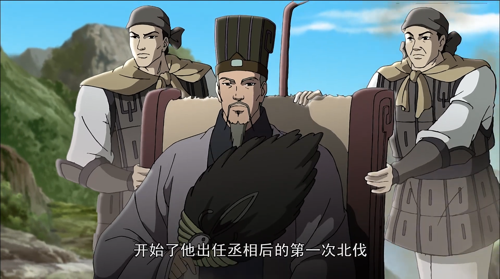​

#### [[05:01]](## "https://www.youtube.com/embed/-TJtczs1McQ")：魏延献计

> ‍

> ​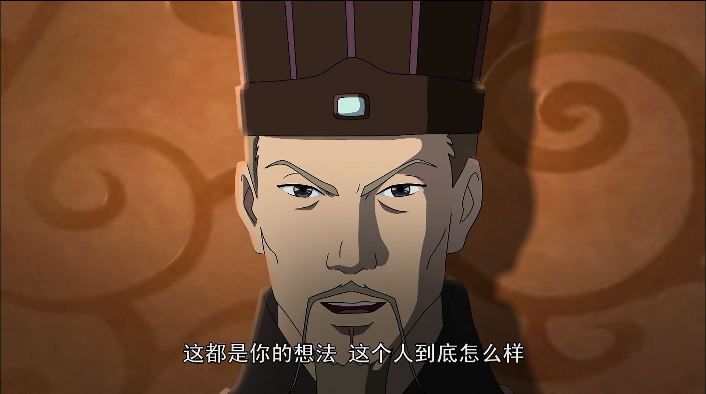​

#### [[07:50]](## "https://www.youtube.com/embed/-TJtczs1McQ")：赵云一人敌四将

> ‍

> ​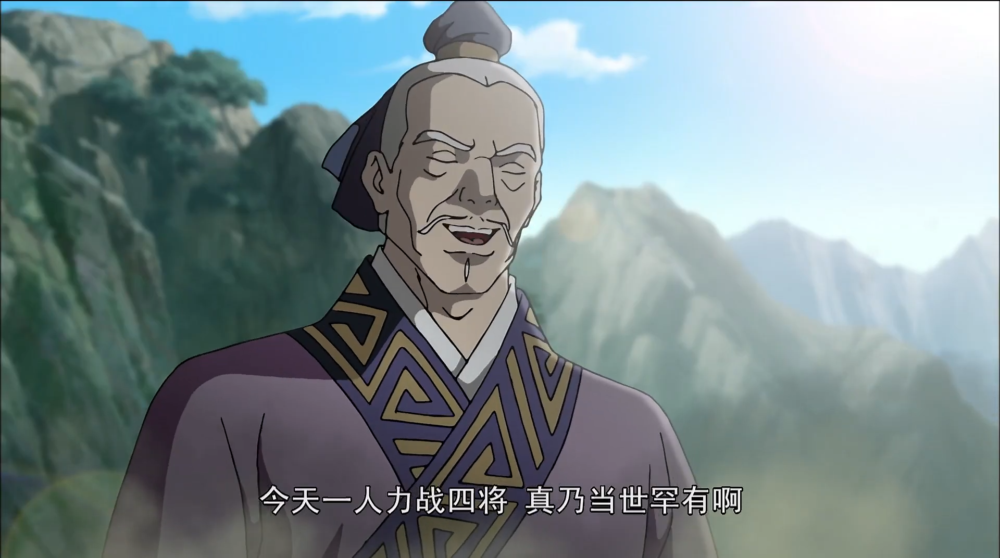​

#### [[08:42]](## "https://www.youtube.com/embed/-TJtczs1McQ")：

> ‍

> ​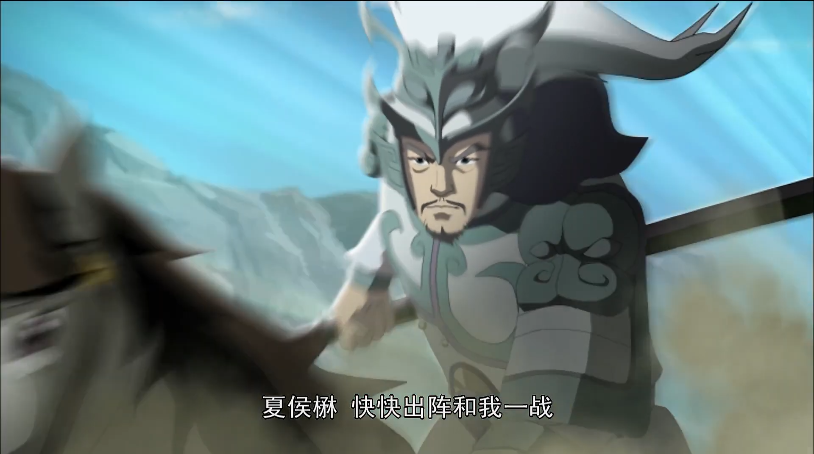​

#### [[10:43]](## "https://www.youtube.com/embed/-TJtczs1McQ")：

> ‍

> ​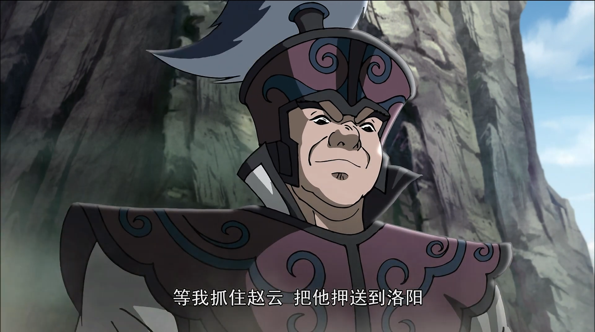​

#### [[11:27]](## "https://www.youtube.com/embed/-TJtczs1McQ")：张苞关兴救援赵云

> ‍

> ​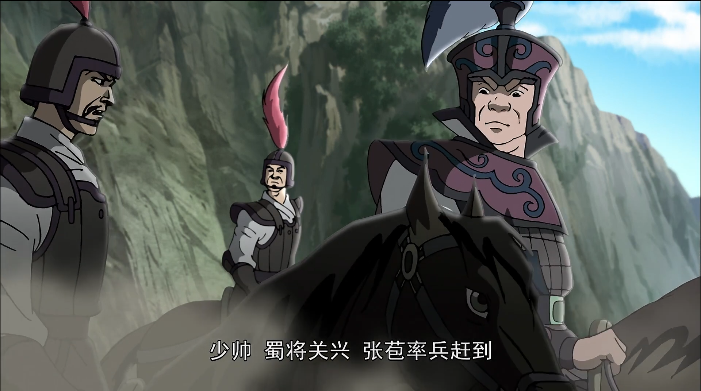​

#### [[12:20]](## "https://www.youtube.com/embed/-TJtczs1McQ")：围攻南安

> ‍

> ​​

#### [[13:50]](## "https://www.youtube.com/embed/-TJtczs1McQ")：

> ‍

> ​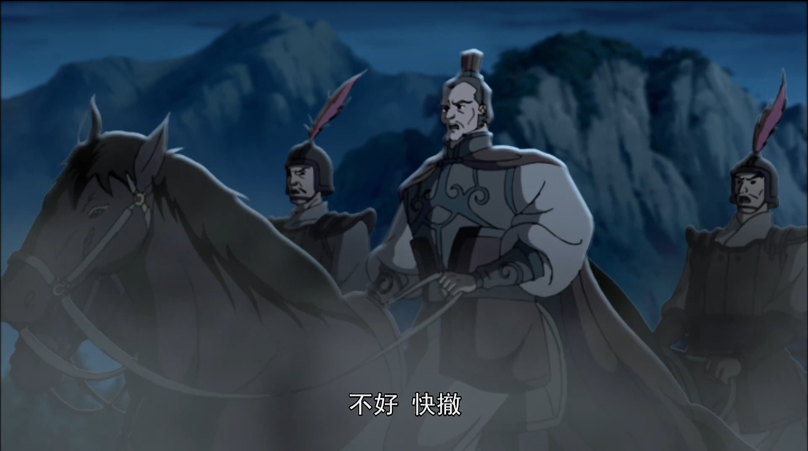​

#### [[15:37]](## "https://www.youtube.com/embed/-TJtczs1McQ")：反间计

> ‍

> ​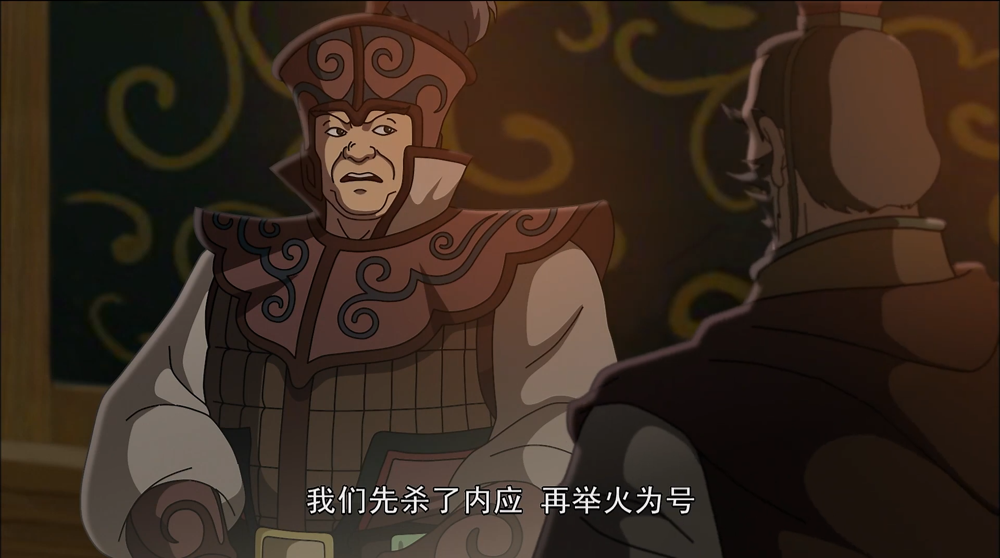​

#### [[17:16]](## "https://www.youtube.com/embed/-TJtczs1McQ")：

> ‍

> ​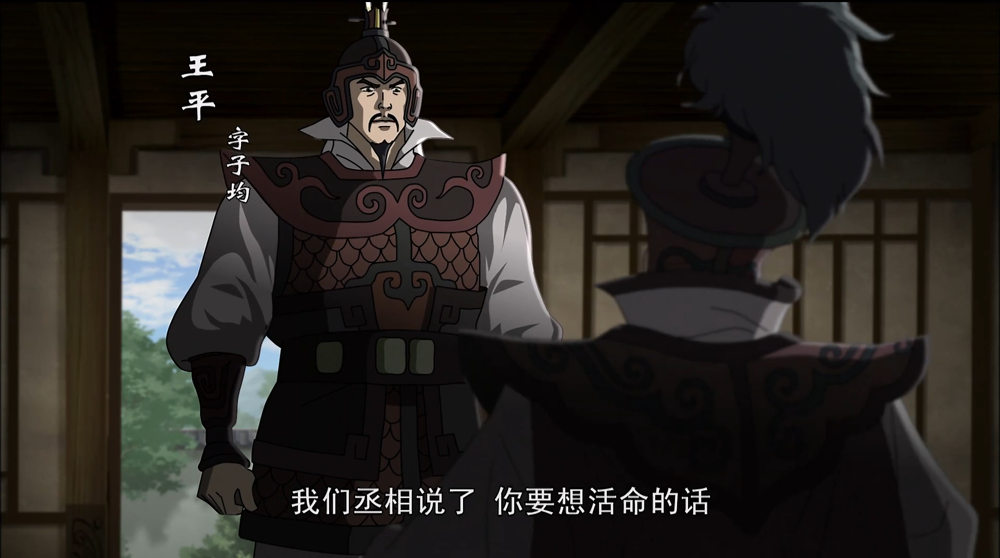​

#### [[17:32]](## "https://www.youtube.com/embed/-TJtczs1McQ")：姜维出场

> ‍

> ​​

#### [[18:58]](## "https://www.youtube.com/embed/-TJtczs1McQ")：赵云姜维PK

> ‍

> ​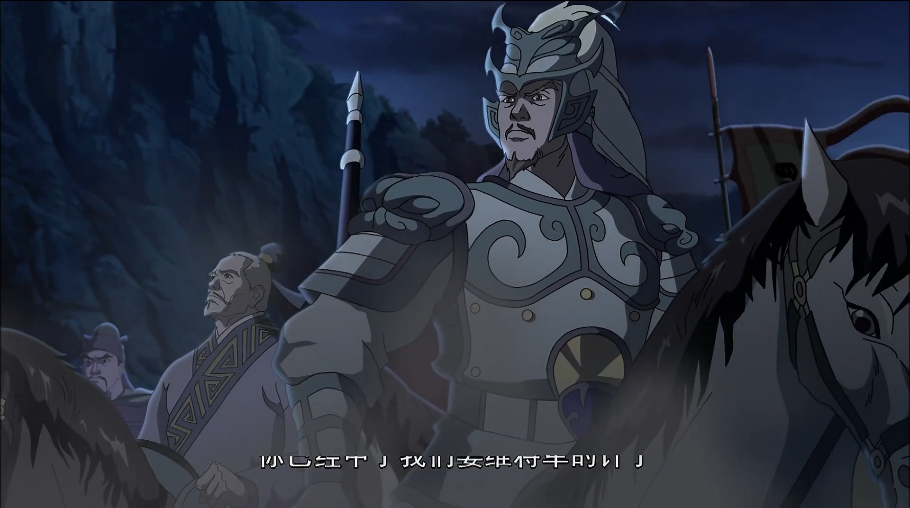​

#### [[20:01]](## "https://www.youtube.com/embed/-TJtczs1McQ")：姜维

> ## 姜维生平  #AI/问题#​
>
> ### 1. **归降蜀汉**
>
> 姜维原本是曹魏的一名中层将领，因父亲早逝，他与母亲相依为命。姜维年轻时聪颖好学，通晓兵法。公元228年，诸葛亮第一次北伐期间，姜维因战局原因被困在孤城天水，迫于形势，他决定归附蜀汉。这一举动不仅展现了姜维的军事才能和决断力，还为蜀汉招揽了一位杰出的将领。
>
> ### 2. **得到诸葛亮的赏识**
>
> 归附蜀汉后，姜维得到了诸葛亮的高度重视。诸葛亮不仅将姜维视为自己的接班人，还对其进行悉心培养，让姜维参与各种军事行动，积累经验。姜维也不负众望，表现出色，逐渐成为蜀汉军中的核心人物。
>
> ### 3. **继承诸葛亮的遗志**
>
> 公元234年，诸葛亮病逝于五丈原，临终前将蜀汉的重任托付给了姜维。此后，姜维正式成为蜀汉的主要军事领导人，承接了诸葛亮的遗志，继续北伐中原，试图恢复汉室。
>
> ### 4. **多次北伐中原**
>
> 姜维继承诸葛亮的战略思想，认为蜀汉必须主动进攻魏国，方能维持国势。因此，他在蜀汉期间发动了多次北伐战役，主要包括以下几次：
>
> * **公元238年**，姜维第一次北伐，进攻陇西，但因粮草不足而撤退。
> * **公元247年**，姜维发起第二次北伐，进攻魏国凉州，虽然取得了一定战果，但未能改变整体战局。
> * **公元253年**，姜维与魏延之子魏封联合进攻魏国的洮阳，虽然战斗激烈，但由于粮草不足和蜀汉内部的反对，北伐再度失败。
>
> ### 5. **镇守汉中**
>
> 姜维长期驻守在蜀汉的北方重镇汉中，负责防御魏国的进攻。他在汉中不仅加强了防御，还实施了一系列的军事改革，以提高蜀汉军队的战斗力。
>
> ### 6. **与东吴的外交关系**
>
> 姜维积极维护与东吴的盟友关系，通过与东吴的联盟，共同对抗曹魏的强大压力。虽然在具体战术上有时未能与东吴协调一致，但他始终努力保持三国之间的微妙平衡，以防止蜀汉被孤立。
>
> ### 7. **策反钟会，最终失败**
>
> 在蜀汉末期，国力衰微，内部矛盾加剧，姜维意识到蜀汉的存亡已到了关键时刻。在公元263年，魏国司马昭发动对蜀汉的全面进攻，姜维在抵抗过程中被迫退守剑阁，并最终无力阻止魏军的进攻。蜀汉投降后，姜维假意归降魏国，实则密谋策反魏国大将钟会，企图利用钟会的野心，重整蜀汉。然而，策反失败，姜维最终被魏将卫瓘所杀，时年63岁。
>
> ### 8. **后世评价**
>
> 姜维的忠诚和勇敢得到了后世的高度评价，他被视为蜀汉忠诚的守护者。他在军事上继承了诸葛亮的策略，尽管在北伐中未能取得决定性的胜利，但他始终坚持为蜀汉复兴而战。姜维的悲剧性结局也象征了蜀汉的最终覆灭，他的忠心耿耿和勇敢无畏的精神在后世的史书中得到了广泛的认可。
>
> 总的来说，姜维是蜀汉后期的一位关键人物，他在蜀汉政权的维系中发挥了至关重要的作用。尽管面临重重困难，他始终坚持斗争，试图挽救蜀汉的命运，这种坚韧和忠诚使他成为三国时期的一位令人敬仰的将领。
>
> ## 诸葛亮和姜维为什么一定要坚持北伐呢  #AI/问题#​
>
> 诸葛亮和姜维坚持北伐主要出于政治、军事、经济等多方面的考量，目的在于巩固蜀汉的地位，恢复汉室天下，以下是他们坚持北伐的主要原因：
>
> ### 1. **恢复汉室的政治目标**
>
> 蜀汉以“复兴汉室”为立国之本，刘备在世时确立了这个目标，诸葛亮作为蜀汉的丞相，继承了这一政治使命。他认为，北伐是实现这一目标的必要手段。对诸葛亮和姜维来说，北伐不仅是军事行动，更是政治宣言，向天下表明蜀汉继承正统的决心和立场。
>
> ### 2. **蜀汉地理与资源的限制**
>
> 蜀汉地处西南，地理位置相对封闭，资源有限，无法长期与魏国相持不下。如果不主动进攻，长期处于防守态势将使蜀汉陷入被动。北伐不仅是为了攻占魏国的领土，更是为了缓解蜀汉在资源和人口上的困境。通过占领魏国的富庶地区，如关中、陇右等，蜀汉可以获得更多的资源和战略纵深，从而增强自身的实力。
>
> ### 3. **主动出击的战略需要**
>
> 诸葛亮认为，在与魏国的对抗中，蜀汉不能坐等魏国进攻，而必须主动出击，以避免陷入被动局面。魏国的国力远胜于蜀汉，如果蜀汉仅采取防御战略，魏国迟早会通过蚕食和瓦解将蜀汉拖垮。北伐能迫使魏国分散兵力，削弱其对蜀汉的直接威胁。
>
> ### 4. **打破魏国的内部矛盾**
>
> 魏国内部虽然强大，但也存在权力斗争和地方割据的矛盾。诸葛亮和姜维认为，通过持续的北伐，可以利用魏国的内部矛盾，特别是在魏国内部的动荡时期，可能促使某些地方势力或者边疆民族反叛，从而进一步削弱魏国的统治基础。
>
> ### 5. **提升蜀汉军队士气**
>
> 北伐不仅是战略上的需要，还是维持蜀汉军队士气的重要手段。蜀汉的军队在刘备时期经历了多次失败，如夷陵之战，士气低落。通过北伐，蜀汉可以保持军队的战斗意志和士气，同时也能够锤炼部队，提高其战斗力。特别是在诸葛亮和姜维的指挥下，北伐成为了一种激励士气、展示军力的重要手段。
>
> ### 6. **巩固蜀汉政权的需要**
>
> 北伐还有一个内政层面的意义，即通过对外战争来巩固国内政权的稳定。蜀汉政权需要通过军事行动来展示自己的正统性和合法性，以此维持内部的团结。诸葛亮通过北伐可以将蜀汉的资源集中到对外战争上，从而避免内部矛盾的激化。
>
> ### 7. **姜维的继承与延续**
>
> 姜维继承了诸葛亮的遗志，继续坚持北伐。他认为只有通过不断的进攻，才能维持蜀汉的存在。因此，在诸葛亮去世后，姜维多次组织北伐，希望通过打击魏国，延续蜀汉的国祚。他的北伐不仅是对诸葛亮策略的延续，也是对蜀汉命运的固执守护。
>
> ### 8. **历史背景的驱动**
>
> 三国时期，各国之间的竞争极为激烈，战争几乎是常态。在这样的历史背景下，任何一方都不能长期保持和平。对于蜀汉来说，如果不主动出击，迟早会被魏国吞并。因此，北伐是历史形势所逼的一个无奈选择。
>
> 总的来说，诸葛亮和姜维坚持北伐的原因是多方面的，既有恢复汉室的政治理想，也有战略上主动出击的考虑，以及内外形势的压力。尽管北伐未能成功，但其背后的动机和意义在当时的历史背景下是可以理解的。

> ​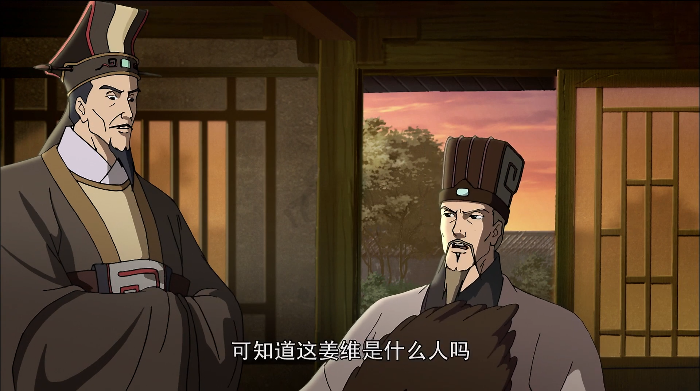​

#### [[21:41]](## "https://www.youtube.com/embed/-TJtczs1McQ")：

> ‍

> ​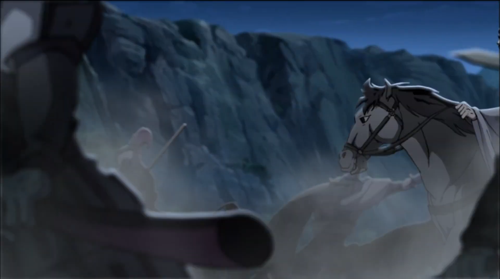​

#### [[22:22]](## "https://www.youtube.com/embed/-TJtczs1McQ")：诸葛亮看好姜维

> ‍

> ​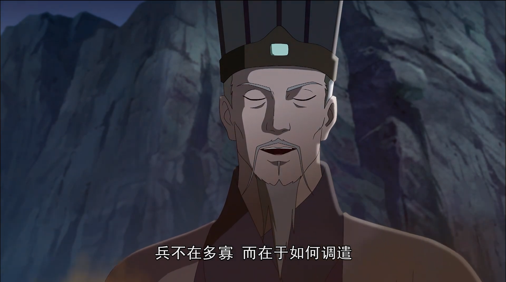​

‍
