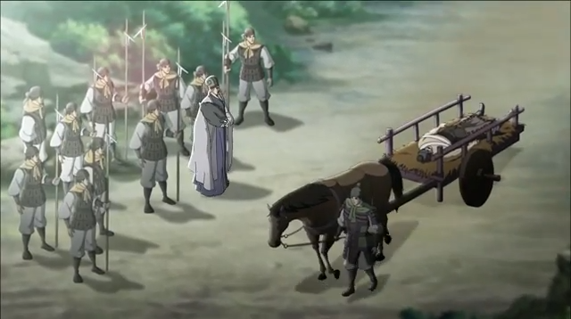
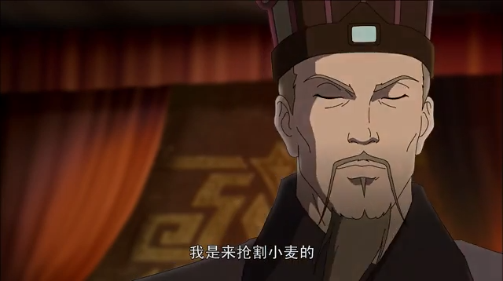
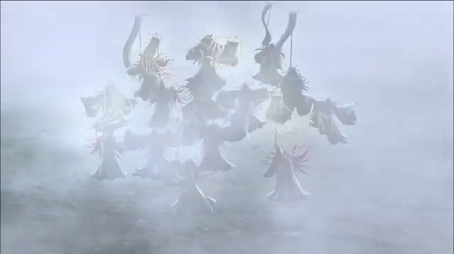
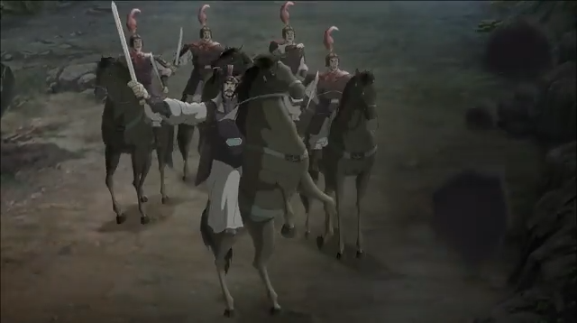

# 48-动画片三国演义 第48集 诸葛妆神 高清

<iframe sandbox="allow-top-navigation-by-user-activation allow-same-origin allow-forms allow-scripts allow-popups" src="https://www.youtube.com/embed/1erS6Efbav8" data-src="" border="0" frameborder="no" framespacing="0" allowfullscreen="true" style="height: 513px; width: 903px; pointer-events: none;"></iframe>

#### 视频笔记

> 作者：#视频笔记/GalaxySpace YouTube#​
>
> 时长：25:01
>
> 状态：#视频笔记/GalaxySpace YouTube/未读#​

#### [&lt;&lt;]()​[[02:47]](## "https://www.youtube.com/embed/1erS6Efbav8")​[&gt;&gt;]()：孙权称帝

> ‍

#### [&lt;&lt;]()​[[03:52]](## "https://www.youtube.com/embed/1erS6Efbav8")​[&gt;&gt;]()：陈仓

> ‍

#### [&lt;&lt;]()​[[04:55]](## "https://www.youtube.com/embed/1erS6Efbav8")​[&gt;&gt;]()：进军陈仓

> ‍

#### [&lt;&lt;]()​[[07:30]](## "https://www.youtube.com/embed/1erS6Efbav8")​[&gt;&gt;]()：司马懿进宫

> ‍

#### [&lt;&lt;]()​[[08:19]](## "https://www.youtube.com/embed/1erS6Efbav8")​[&gt;&gt;]()：四出岐山攻取长安

> ‍

#### [&lt;&lt;]()​[[11:23]](## "https://www.youtube.com/embed/1erS6Efbav8")​[&gt;&gt;]()：张苞落水而死

> ‍

> ​​

#### [&lt;&lt;]()​[[15:02]](## "https://www.youtube.com/embed/1erS6Efbav8")​[&gt;&gt;]()：蜀军缺粮

> ‍

> ​​

#### [&lt;&lt;]()​[[16:30]](## "https://www.youtube.com/embed/1erS6Efbav8")​[&gt;&gt;]()：诸葛亮装神弄鬼

> 收割小麦

> ​​

#### [&lt;&lt;]()​[[22:16]](## "https://www.youtube.com/embed/1erS6Efbav8")​[&gt;&gt;]()：张郃之死

> ‍

> ​​

‍
