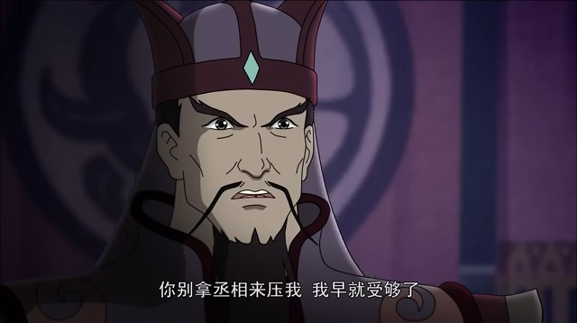
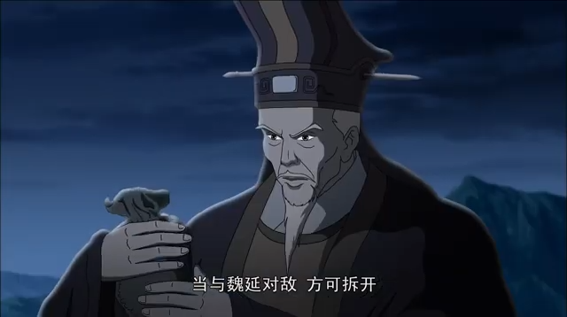
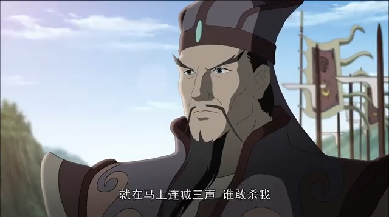
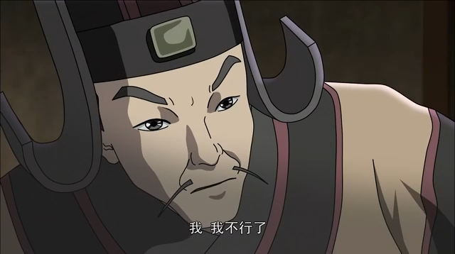
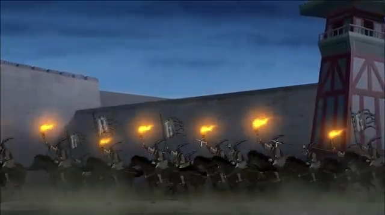
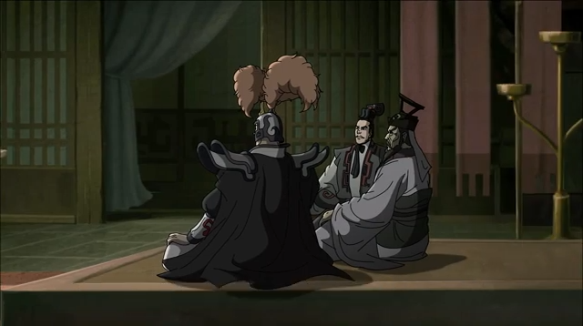
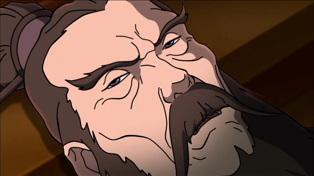
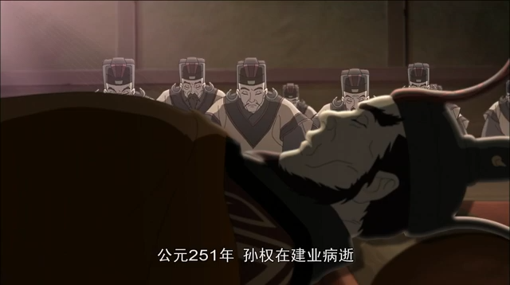

# 51-动画片三国演义 第51集 政归司马氏 高清

<iframe sandbox="allow-top-navigation-by-user-activation allow-same-origin allow-forms allow-scripts allow-popups" src="https://www.youtube.com/embed/nCdzAQPeIrI" data-src="" border="0" frameborder="no" framespacing="0" allowfullscreen="true" style="height: 513px; width: 903px; pointer-events: none;"></iframe>

#### 视频笔记

> 作者：#视频笔记/GalaxySpace YouTube#​
>
> 时长：25:01
>
> 状态：#视频笔记/GalaxySpace YouTube/未读#​

#### [&lt;&lt;]()​[[04:57]](## "https://www.youtube.com/embed/nCdzAQPeIrI")​[&gt;&gt;]()：魏延之反

> 20240817020942-ooe3a6z

> ​​

#### [&lt;&lt;]()​[[08:27]](## "https://www.youtube.com/embed/nCdzAQPeIrI")​[&gt;&gt;]()：锦囊妙计

> ‍

> ​​

#### [&lt;&lt;]()​[[09:21]](## "https://www.youtube.com/embed/nCdzAQPeIrI")​[&gt;&gt;]()：

> ‍

> ​​

#### [&lt;&lt;]()​[[09:44]](## "https://www.youtube.com/embed/nCdzAQPeIrI")​[&gt;&gt;]()：马岱斩杀魏延

> ‍

> ​​

#### [&lt;&lt;]()​[[10:49]](## "https://www.youtube.com/embed/nCdzAQPeIrI")​[&gt;&gt;]()：司马懿装病

> ## 司马懿和曹爽之争  #AI/问题#​
>
> 司马懿和曹爽是三国时期曹魏的重要政治人物，他们之间的关系复杂且充满权力斗争。以下是他们之间关系的主要历史事件和阶段：
>
> 1. **共同辅政**：曹魏景初三年（公元239年），魏明帝曹叡驾崩后，留下遗诏命令太尉司马懿和宗室大将军曹爽辅佐八岁的皇太子曹芳登基。曹芳登基后，军国大事皆委托给曹爽和司马懿。
> 2. **权力斗争**：曹爽辅政后，开始排除异己，擅权专政。他将司马懿迁官为无实权的太傅，打压外戚势力，并在朝廷安插自己的眼线，把握政务。
> 3. **司马懿韬光养晦**：司马懿被“明升暗降”后，表现得十分低调，实际上是在韬光养晦，等待机会反击。
> 4. **高平陵政变**：嘉平元年（公元249年）正月，皇帝曹芳前往高平陵祭奠祖先，曹爽等人陪同。司马懿看准机会，在城中布防，并以太后郭氏的名义下召，关闭城门，并派兵驻守在皇帝回京的路上。控制洛阳后，司马懿劝说曹爽投降，曹爽最终投降。
> 5. **政变结果**：政变后，曹魏的军权政权逐渐落入司马氏手中。司马懿背信弃义，灭曹爽三族，清除了曹氏宗室在朝中的势力，司马氏得以完全掌握了权力，控制了曹魏朝政。
> 6. **后续影响**：高平陵之变后，司马氏正式成为魏国的实际控制者，司马懿被尊为太傅，虽然表面谦称辅佐幼主，但实际上掌握了朝政大权。这一事件为日后司马炎代魏立晋奠下了根基。
>
> 综上所述，司马懿和曹爽的关系从最初的合作辅政，发展到后来的权力斗争和政变，最终以司马懿的胜利和曹爽的失败告终，这一过程对三国时期的历史进程产生了深远的影响。

> ​​

#### [&lt;&lt;]()​[[11:44]](## "https://www.youtube.com/embed/nCdzAQPeIrI")​[&gt;&gt;]()：司马懿兵变

> ‍

> ​​

#### [&lt;&lt;]()​[[14:07]](## "https://www.youtube.com/embed/nCdzAQPeIrI")​[&gt;&gt;]()：曹爽灭族

> ‍

> ​​

#### [&lt;&lt;]()​[[17:36]](## "https://www.youtube.com/embed/nCdzAQPeIrI")​[&gt;&gt;]()：司马懿病逝

> ‍

> ​​

#### [&lt;&lt;]()​[[18:36]](## "https://www.youtube.com/embed/nCdzAQPeIrI")​[&gt;&gt;]()：孙权病逝

> ‍

> ​​

‍
