# 52-动画片三国演义 第52集 三国归晋 高清

<iframe sandbox="allow-top-navigation-by-user-activation allow-same-origin allow-forms allow-scripts allow-popups" src="https://www.youtube.com/embed/H-Fafh3AbvQ" data-src="" border="0" frameborder="no" framespacing="0" allowfullscreen="true" style="height: 513px; width: 903px; pointer-events: none;"></iframe>

#### 视频笔记

> 作者：#视频笔记/GalaxySpace YouTube#​
>
> 时长：25:01
>
> 状态：#视频笔记/GalaxySpace YouTube/未读#​

#### [&lt;&lt;]()​[[04:18]](## "https://www.youtube.com/embed/H-Fafh3AbvQ")​[&gt;&gt;]()：围困司马昭

> ‍

> ​​

#### [&lt;&lt;]()​[[05:23]](## "https://www.youtube.com/embed/H-Fafh3AbvQ")​[&gt;&gt;]()：邓艾钟会

> ‍

> ​​

#### [&lt;&lt;]()​[[05:54]](## "https://www.youtube.com/embed/H-Fafh3AbvQ")​[&gt;&gt;]()：司马师病死

> ‍

> ​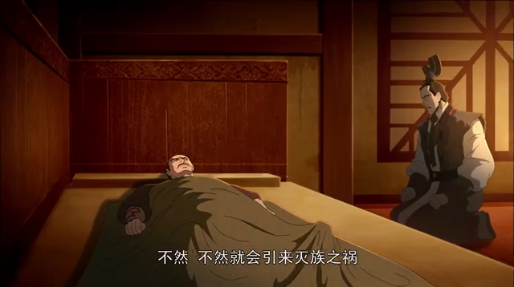​

#### [&lt;&lt;]()​[[06:10]](## "https://www.youtube.com/embed/H-Fafh3AbvQ")​[&gt;&gt;]()：司马昭上位

> ‍

> ​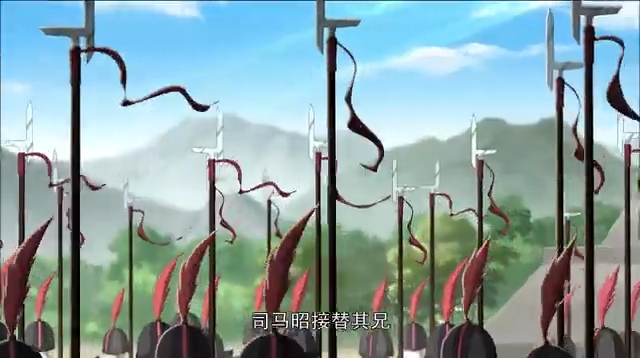​

#### [&lt;&lt;]()​[[07:58]](## "https://www.youtube.com/embed/H-Fafh3AbvQ")​[&gt;&gt;]()：离间计

> ‍

> ​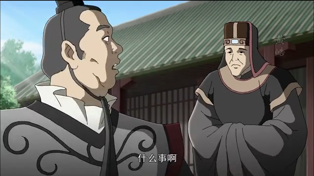​

#### [&lt;&lt;]()​[[09:18]](## "https://www.youtube.com/embed/H-Fafh3AbvQ")​[&gt;&gt;]()：陇西屯田丢失汉中

> ‍

> ​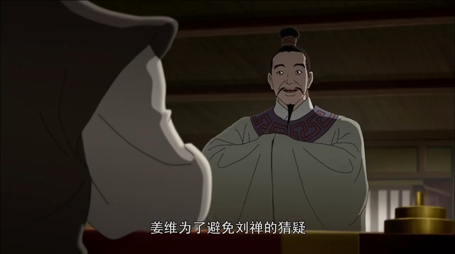​

#### [&lt;&lt;]()​[[11:32]](## "https://www.youtube.com/embed/H-Fafh3AbvQ")​[&gt;&gt;]()：钟会邓艾之争

> ‍

> ​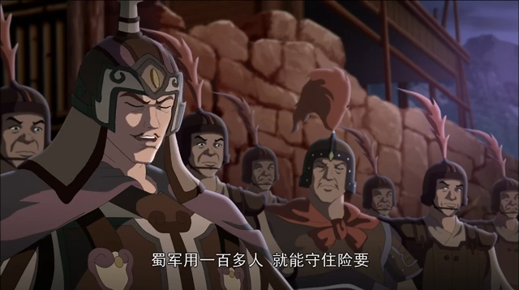​

#### [&lt;&lt;]()​[[13:43]](## "https://www.youtube.com/embed/H-Fafh3AbvQ")​[&gt;&gt;]()：邓艾杀奔成都

> ‍

> ​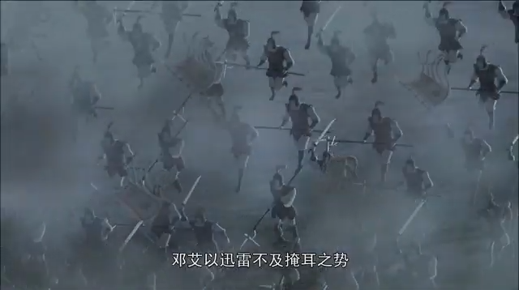​

#### [&lt;&lt;]()​[[15:15]](## "https://www.youtube.com/embed/H-Fafh3AbvQ")​[&gt;&gt;]()：刘禅投降

> ‍

> ​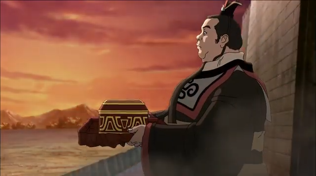​

#### [&lt;&lt;]()​[[16:50]](## "https://www.youtube.com/embed/H-Fafh3AbvQ")​[&gt;&gt;]()：姜维设计钟会

> ‍

> ​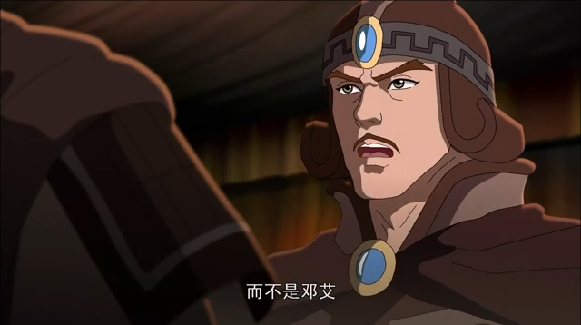​

#### [&lt;&lt;]()​[[19:56]](## "https://www.youtube.com/embed/H-Fafh3AbvQ")​[&gt;&gt;]()：钟会之死

> ‍

> ​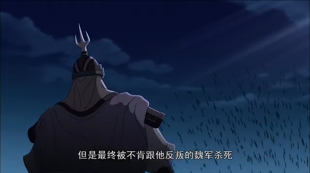​

#### [&lt;&lt;]()​[[20:16]](## "https://www.youtube.com/embed/H-Fafh3AbvQ")​[&gt;&gt;]()：姜维之死

> ‍

> ​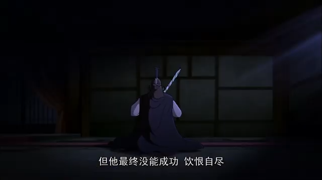​

#### [&lt;&lt;]()​[[20:47]](## "https://www.youtube.com/embed/H-Fafh3AbvQ")​[&gt;&gt;]()：乐不思蜀

> ‍

> ​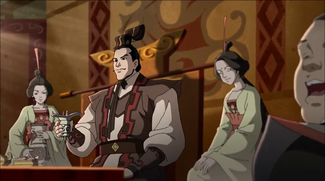​

#### [&lt;&lt;]()​[[21:14]](## "https://www.youtube.com/embed/H-Fafh3AbvQ")​[&gt;&gt;]()：司马昭病逝

> ‍

> ​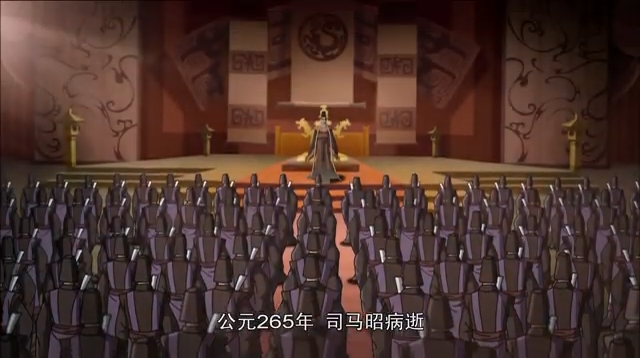​

#### [&lt;&lt;]()​[[21:24]](## "https://www.youtube.com/embed/H-Fafh3AbvQ")​[&gt;&gt;]()：司马炎上位

> ‍

> ​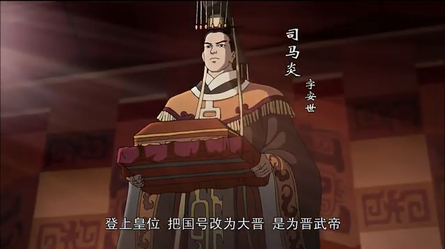​

#### [&lt;&lt;]()​[[22:00]](## "https://www.youtube.com/embed/H-Fafh3AbvQ")​[&gt;&gt;]()：孙皓投降

> ‍

> ​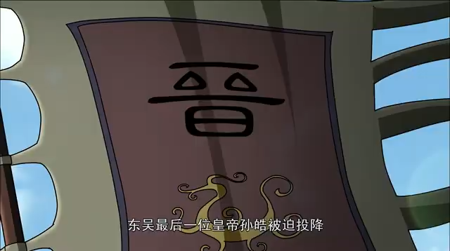​

‍
